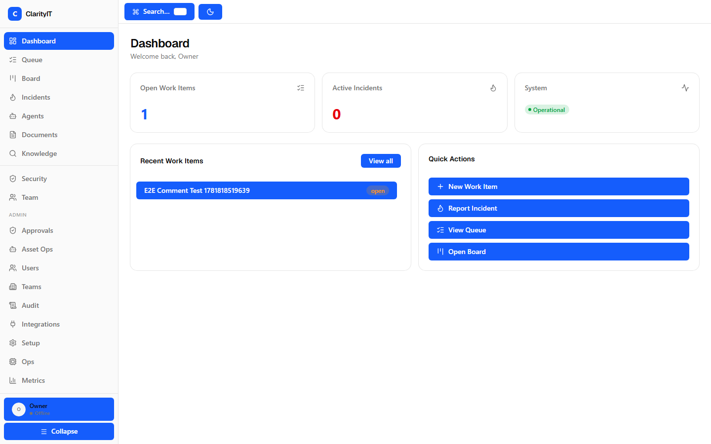

# ClarityIT — AI-Native IT Operations OS

[](https://github.com/Octo-Lex/ClarityIT/actions/workflows/ci.yml)
[](LICENSE)
[](https://go.dev)
[](https://react.dev)



**An AI operations platform that runs entirely on infrastructure you control.**

ClarityIT brings AI-assisted incident response, knowledge retrieval, and agent-driven automation to sovereign IT environments — without sending your data to third-party SaaS. Deploy on Proxmox, manage through the web, let agents help under strict human-in-the-loop safety boundaries.

### Who it's for

- **IT operations teams** who want AI assistance without surrendering data to external clouds
- **Sovereign / on-prem deployments** that need full control of the stack (Proxmox origin, self-hosted everything)
- **Platform engineers** building internal tooling who want a structured agent autonomy model, not a chatbot bolted onto a dashboard

### Why it's different

- **Sovereign by design** — no external AI SaaS, no vector DB dependency, no external search service. PostgreSQL FTS + pgvector handle retrieval; the reasoning worker is isolated and has no database access.
- **Agents that can't run wild** — the ESAA model (Structured Agent Intentions) caps autonomy at A4 (A5 is hardcoded-disabled). Agents emit *intentions* through a 13-check Tool Gateway; destructive mutations are impossible by construction.
- **The worker is air-gapped** — the Python reasoning worker has no `DATABASE_URL`, `NATS_URL`, `REDIS_URL`, or `MINIO_ENDPOINT`. It fails closed if any are set. It talks to the Go API over HTTP only.
- **Proxmox-first, not Proxmox-only** — the compute provider is behind an interface ([ADR-021](docs/adr/ADR-021-compute-provider-interface.md)). Proxmox is the first implementation; adding another provider is additive.

### Quick start

```bash
git clone https://github.com/Octo-Lex/ClarityIT.git
cd ClarityIT

# Configure your environment
cp .env.example .env   # edit with your local values

# Launch the full stack (API + web + worker + Postgres + NATS + Redis + MinIO)
docker compose up -d

# Bootstrap the platform owner + first team
curl -X POST http://localhost:8765/api/bootstrap \
  -H 'Content-Type: application/json' \
  -d '{"name":"Owner","email":"owner@example.com","password":"change-me-now","team_name":"Platform"}'

# Open the UI
open http://localhost:3000
```

**Prerequisites:** Docker + Docker Compose. That's it — the stack is self-contained.

> **Frontend development:** `cd web && npm install && npm run dev` (set `VITE_API_URL` to point the dev proxy at your API instance).

### Roadmap

| Area | Status | Next |
|---|---|---|
| **Core platform** (IAM, objects, work items, incidents) | ✅ v1.0 | Stable |
| **Agent runtime** (ESAA, Tool Gateway, A0–A4) | ✅ v1.1 | Stable |
| **Operational intelligence** (remediation, risk scoring, dry-run) | ✅ v1.2 | Stable |
| **Team productivity** (documents, templates, presentations) | ✅ v1.3 | Stable |
| **Document productivity** (block editor, versions, export) | ✅ v1.4 | Stable |
| **Knowledge productivity** (FTS search, Ask Clarity, collections) | ✅ v1.5 | Stable |
| **Web UI rebuild** (React Query, design system, 427 tests) | ✅ unreleased | Merging to main |
| **Additional compute providers** (Hetzner, K8s, libvirt) | 🔜 | Design phase — see [ADR-021](docs/adr/ADR-021-compute-provider-interface.md) |
| **OpenAPI spec publication** | 🔜 | In progress |
| **Plugin/provider SDK** | 🔜 | Post-second-provider |

See [CHANGELOG.md](CHANGELOG.md) for version history and [`docs/releases/`](docs/releases/) for detailed release notes.

## Architecture

```
┌─────────────┐    ┌──────────────┐    ┌─────────────┐
│  React 19   │───▶│  Go API      │───▶│ PostgreSQL  │
│  Frontend   │◀───│  (chi/pgx)   │◀───│  37 tables  │
└─────────────┘    └──────┬───────┘    └─────────────┘
                          │
              ┌───────────┼───────────┐
              ▼           ▼           ▼
       ┌──────────┐ ┌──────────┐ ┌──────────────┐
       │  NATS    │ │  Redis   │ │ Python Worker│
       │JetStream │ │  Pub/Sub │ │ (Reasoning)  │
       └──────────┘ └──────────┘ └──────────────┘
              │           │
       ┌──────────┐ ┌──────────┐
       │  Outbox  │ │   WS     │
       │  Worker  │ │   Hub    │
       └──────────┘ └──────────┘
       ┌──────────┐
       │ Context  │
       │  Worker  │
       └──────────┘
```

## Services (Docker Compose)

| Service | Port | Description |
|---------|------|-------------|
| `clarityit-api` | 8765 | Go control plane (chi router, pgx, JWT auth) |
| `clarityit-web` | 3000 | React 19 frontend (nginx proxy) |
| `clarityit-outbox-worker` | — | Go worker: PostgreSQL outbox → NATS publish + Redis fanout |
| `clarityit-context-worker` | — | Go worker: NATS consumer → context graph (nodes, edges, evidence) |
| `clarityit-reasoning-worker` | — | Python worker: poll pending runs → generate intentions via ModelGateway |
| `postgres` | 5432 | PostgreSQL 16 — 37 tables, migrations 001–019 |
| `nats` | 4222 | NATS JetStream — `CLARITY_EVENTS` + `CLARITY_DLQ` streams |
| `redis` | 6379 | Redis — WS pub/sub fanout |
| `minio` | 9000 | MinIO — object storage |

## Agent Runtime Architecture

Phase 7 implements the Genesis agent autonomy model:

### A0–A5 Autonomy Ladder

| Level | Meaning |
|-------|---------|
| A0 | Read-only — no mutations |
| A1 | Low-risk reads with logging |
| A2 | Low-risk writes (comments, timeline) |
| A3 | Standard operations (status changes, assignments) |
| A4 | Significant changes (create/close incidents) |
| A5 | Full autonomy (all tools, approval bypass) |

### Tool Gateway Enforcement

Every agent tool execution passes through:

1. **Agent active?** — soft-deleted/disabled agents blocked
2. **Run active?** — only `pending`/`running` runs accepted
3. **Tool registered?** — must exist in `tool_registry` with risk level
4. **Grant exists?** — `agent_tool_grants` must have active, non-expired, non-revoked entry
5. **Autonomy check** — requested level ≤ agent max AND ≤ grant max
6. **Approval block** — `requires_approval = true` → blocked
7. **MFA block** — `requires_mfa = true` → blocked (real MFA deferred)
8. **Risk block** — `medium+` risk → blocked (until approval workflow)

### Data Flow

```
User creates Agent Identity → Grants tools → Triggers Run
                                          ↓
Python Reasoning Worker polls pending runs
  → StubModelGateway generates Intention
  → POSTs structured intention to Go API
                                          ↓
Tool Gateway validates:
  ✓ Agent active, run active, grant exists
  ✓ Autonomy within bounds
  ✓ No approval/MFA required
  ✓ Risk level acceptable
  → Execute or Block (with audit + outbox event)
```

### Reasoning Worker Isolation

The Python reasoning worker has **NO direct access** to:
- PostgreSQL (`DATABASE_URL` not set)
- NATS (`NATS_URL` not set)
- Redis (`REDIS_URL` not set)
- MinIO (`MINIO_ENDPOINT` not set)

It communicates **only** through the Go API HTTP interface.

## Model Gateway

```python
from model_gateway import StubModelGateway, IntentionShape

gateway = StubModelGateway()
intention = gateway.generate_intention(
    agent_run_id="...",
    context={},
    tool_grants=[...],
)
# intention is a validated IntentionShape with reasoning_summary
# chain_of_thought is always rejected/stripped
```

Placeholders exist for: `OpenAICompatibleGateway`, `LiteLLMGateway`, `LocalOllamaGateway`.

## Compute Integration

ClarityIT manages infrastructure assets through a **provider interface**, not a
hardcoded binding. Proxmox is the **first implementation** — not the only
option.

### Provider boundary

```go
// services/api/internal/proxmox/handler.go
type ProxmoxClient interface {
    ListNodes(ctx context.Context) ([]ProxmoxNode, error)
    ListVMs(ctx context.Context, node string) ([]ProxmoxVM, error)
    StartVM(ctx context.Context, target MutationTarget) (string, error)
    ShutdownVM(ctx context.Context, target MutationTarget) (string, error)
    StopVM(ctx context.Context, target MutationTarget) (string, error)
    SnapshotVM(ctx context.Context, target MutationTarget, snapName string) (string, error)
    GetTaskStatus(ctx context.Context, node, taskID string) (*TaskStatus, error)
}
```

When `PROXMOX_ENABLED=false` (the default), the platform uses a
`FakeProxmoxClient` stub — all routes function, no real infrastructure is
touched. This is how the test suite and local development work.

### Adding a new provider

The provider boundary is the interface. To add support for another platform
(Hetzner Cloud, Kubernetes, libvirt, AWS, etc.):

1. Implement the client interface (read + the four allowed mutations:
   start / shutdown / stop / snapshot).
2. Register routes under `/integrations/<provider>/`.
3. Wire it in `main.go` behind its own config flag.

No changes to the Tool Gateway, approval workflow, agent runtime, or frontend
are needed — the safety model (ESAA, A0–A4 autonomy, mutation windows) is
provider-agnostic and applies to all compute integrations equally.

### Why Proxmox first

Proxmox VE is open-source, self-hostable, and fits the sovereign-hybrid
deployment model. It provides the full lifecycle (VMs, containers, snapshots,
storage) through a stable HTTP API — making it the strongest reference
implementation for a platform designed to run entirely on infrastructure you
control.

## Database Schema

18 migrations create 37+ tables across:
- **IAM**: users, teams, roles, permissions, sessions, tokens, invitations, access grants
- **Core**: objects, work_items, incidents, projects, links, comments
- **Events**: audit_logs, outbox_events, idempotency_keys, context_nodes, context_edges
- **Agent**: agent_identities, agent_tool_grants, agent_runs, agent_intentions, agent_effect_results, tool_registry
- **Integration**: integration_api_keys, assets, alerts, object_attachments

## Testing

```bash
# Backend (142 tests)
cd services/api && go test -p 1 -count=1 -timeout 180s ./...

# Frontend (21 tests)
cd web && npm test

# Python model gateway (9 tests)
cd services/workers/reasoning && python -m pytest test_model_gateway.py -v
```

Total: **172 tests** (142 backend + 21 frontend + 9 Python)

## Phase 8: Integrations

| Feature | Route | Auth |
|---------|-------|------|
| Integration Keys | `POST/GET/DELETE /api/teams/{id}/integration-keys` | JWT |
| Webhook Receiver | `POST /api/webhooks/{source}` | Integration Key |
| Proxmox Status | `GET /api/teams/{id}/integrations/proxmox/status` | JWT |
| Proxmox Sync | `POST /api/teams/{id}/integrations/proxmox/sync` | JWT |
| Assets | `GET /api/teams/{id}/assets` | JWT |
| Deep Health | `GET /api/health/deep` | JWT |

## Deployment

```bash
# Build and deploy all
docker compose up -d --build

# Reasoning worker needs WORKER_TOKEN
WORKER_TOKEN=<token> TEAM_ID=<uuid> docker compose up -d clarityit-reasoning-worker
```

## License

Licensed under the [Apache License, Version 2.0](LICENSE).
