# ClarityIT v2 — Authoritative Operation Sequence

**Diagram version:** 0.2
**Status:** Target-state normative companion to Product Definition v0.1 and Kernel v0.1
**Draft dependency:** Destination-bound Credential Broker from Native Pattern P-09; proposed until separately approved
**Rendered asset:** [`images/authoritative-command-evidence-verification-flow.png`](images/authoritative-command-evidence-verification-flow.png)

This view makes the physical dispatch, evidence-sealing, verification, and human
outcome-decision boundaries explicit. Every solid transition that changes product
truth is committed through the Control API/domain kernel to PostgreSQL with audit
and outbox state.

```mermaid
flowchart TB
    subgraph PREPARE["A. Propose and authorize"]
        direction LR
        CASE["1. CASE WORKSPACE<br/>Objective · accountable principal · resource · success criteria"]
        PACKET["2. CONTROL API / DOMAIN KERNEL<br/>Persist immutable Operation Packet<br/>baseline · postconditions · stop conditions"]
        GRANT["3. AUTHORITY<br/>Policy + approvals + scoped grant<br/>bound to packet digest"]
        CASE -->|"Propose"| PACKET -->|"Evaluate"| GRANT
    end

    subgraph DISPATCH["B. Persist before dispatch"]
        direction LR
        BROKER["4. EFFECT BROKER<br/>Fresh preflight · idempotency · reserve attempt"]
        PGD["5. POSTGRESQL TRANSACTION<br/>Attempt + dispatch record + audit + outbox"]
        NATS["6. NATS JETSTREAM<br/>execution.dispatch.requested<br/>transport only"]
        EXEC["7. EXECUTE<br/>Consume committed command<br/>validate route/profile · reconcile lifecycle"]
        GRANT -->|"Signed packet + grant"| BROKER
        BROKER -->|"Atomic write"| PGD
        PGD -->|"Publish committed outbox"| NATS
        NATS -->|"Only physical dispatch path"| EXEC
    end

    subgraph EFFECT["C. Typed effect and source-attributed claim"]
        direction LR
        CRED["8. DESTINATION-BOUND CREDENTIAL BROKER<br/>Internal adapter injection only · proposed P-09"]
        ADAPTER["9. TYPED ADAPTER / CONNECTOR<br/>Provider-neutral capability translation"]
        TARGET["10. MANAGED SYSTEM<br/>Provider operation and real-world state"]
        CLAIM["11. RECEIPT / RESULT CLAIM<br/>Attempted · accepted · running · completed · failed<br/>never self-verifying"]
        EXEC -->|"Packet + workload + route binding"| CRED
        CRED -->|"Narrow credential reference / injection"| ADAPTER
        EXEC -->|"Typed request"| ADAPTER
        ADAPTER -->|"Provider call"| TARGET
        TARGET -->|"Receipt, poll state, result"| CLAIM
    end

    subgraph EVIDENCE["D. Seal evidence and verify independently"]
        direction LR
        OBJECTS["12. OBJECT STORAGE<br/>Upload immutable bytes<br/>object version + digest"]
        INGRESS["13. RESULT INGRESS<br/>Authenticate · deduplicate · normalize<br/>validate object version and digest"]
        PGE["14. POSTGRESQL TRANSACTION<br/>Claim + artifact refs + manifest + audit + outbox"]
        VERIFY["15. VERIFY<br/>Fresh independent observations<br/>versioned postconditions"]
        PGV["16. POSTGRESQL TRANSACTION<br/>Persist Verification + evidence refs + outcome_pending + outbox"]
        CLAIM -->|"Bytes and metadata"| OBJECTS
        CLAIM -->|"Signed envelope + object digest"| INGRESS
        OBJECTS -->|"Exact object version + digest"| INGRESS
        INGRESS -->|"Validated claim and references"| PGE
        PGE -->|"verification.requested via outbox/NATS"| VERIFY
        VERIFY -->|"Passed / failed / inconclusive through Control API"| PGV
    end

    subgraph OUTCOME["E. Accountable outcome decision"]
        direction LR
        UI["17. CASE WORKSPACE<br/>Show Verification, evidence and outcome_pending"]
        HUMAN["18. ACCOUNTABLE PRINCIPAL<br/>Accept · reject · require successor<br/>or separately authorize compensation"]
        PGO["19. CONTROL API / DOMAIN KERNEL → POSTGRESQL<br/>Persist OutcomeDecision + audit + outbox<br/>preserve append-only lineage"]
        PGV -->|"Committed projection / WebSocket progress"| UI
        UI -->|"Decision request"| HUMAN
        HUMAN -->|"Authenticated OutcomeDecision command"| PGO
    end

    classDef control fill:#eef6ff,stroke:#285b8f,stroke-width:1.5px,color:#172033;
    classDef authority fill:#f2faf4,stroke:#2d7d46,stroke-width:1.5px,color:#172033;
    classDef transport fill:#fff8ef,stroke:#d67a00,stroke-width:1.5px,color:#172033;
    classDef claim fill:#fffdf2,stroke:#9a6700,stroke-width:1.5px,color:#172033;
    classDef verified fill:#eefaf3,stroke:#1f7a46,stroke-width:1.5px,color:#172033;
    classDef proposed fill:#fffdf2,stroke:#9a6700,stroke-width:1.5px,stroke-dasharray:5 4,color:#172033;

    class CASE,PACKET,BROKER,EXEC,INGRESS,UI,PGO control;
    class GRANT,HUMAN authority;
    class PGD,NATS,OBJECTS,PGE transport;
    class TARGET,CLAIM claim;
    class VERIFY,PGV verified;
    class CRED proposed;

    style PREPARE fill:#f8fbff,stroke:#7aa2c7,stroke-width:1px
    style DISPATCH fill:#f8fbff,stroke:#7aa2c7,stroke-width:1px
    style EFFECT fill:#fffdf7,stroke:#d1a33f,stroke-width:1px
    style EVIDENCE fill:#f8fbff,stroke:#7aa2c7,stroke-width:1px
    style OUTCOME fill:#f5fbf7,stroke:#69a77f,stroke-width:1px
```

## Binding rules

- The Broker-to-PostgreSQL-to-NATS-to-Execute chain is the only physical dispatch path.
- The credential broker is adapter/probe-internal; Reason, packets, browser clients,
  general-purpose Execute logic, messages, logs, evidence exports, and search never
  receive reusable target credentials.
- Object storage establishes immutable bytes, not product truth. Product evidence is
  sealed only when validated references, manifest, audit, and outbox state commit.
- Provider completion, object upload, and persistence remain claims. Verification is
  independent and versioned. Acceptance is a later identified-principal decision.
- Compensation is a successor Operation Packet with separate authority and lineage.

> `Proposed ≠ Authorized ≠ Dispatched ≠ Provider completed ≠ Verified ≠ Accepted`
