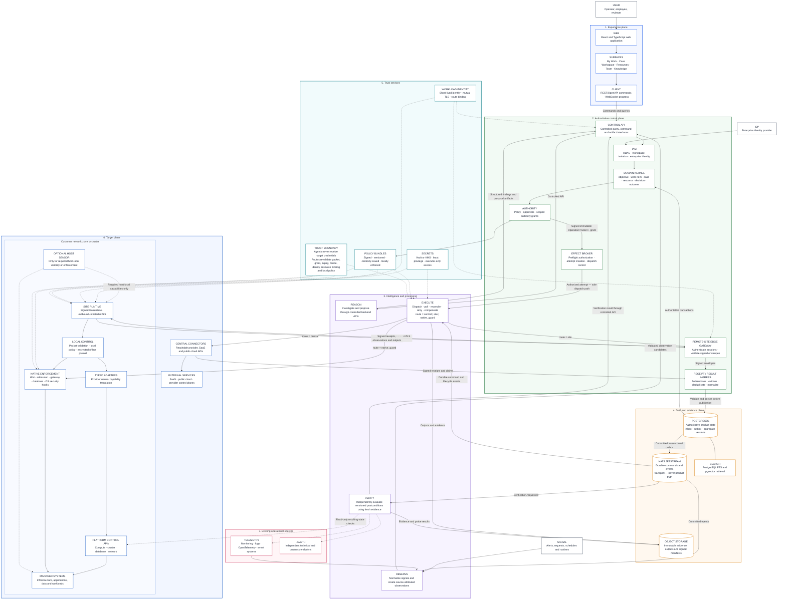

# ClarityIT v2 — Layered System Architecture

> **Scope:** Target-state reference architecture. Site Runtime, Native Enforcement,
> and the optional Host Sensor are future architecture and are outside WP-00 and
> the initial central-route Proxmox slice.

## Relationship legend

| Notation | Meaning |
|---|---|
| Solid directed line | Authoritative command, transaction, or committed lifecycle flow |
| Dashed directed line | Observation, read-only proof, identity, policy, or trust control |
| Bidirectional line | Mutually authenticated session or authoritative transaction exchange |
| `PostgreSQL → NATS JetStream` | Persist-before-publish path through the committed transactional outbox |

## Binding invariants

1. The Effect Broker dispatches only through Execute.
2. Execute owns route selection and execution-lifecycle tracking.
3. Inbound receipts and results become authoritative records only after validation
   and PostgreSQL commit; persistence does not make a claim Verified or Accepted.
4. NATS JetStream carries committed commands and events; it never creates product
   truth.
5. Reasoning workers submit findings and proposals through controlled backend APIs.
6. Provider, worker and agent outputs remain source-attributed claims after
   persistence. Only independent verification can establish a verified result,
   and only a separate outcome decision can accept it.

> **Execution truth invariant:** Provider, worker and agent outputs remain
> source-attributed claims after persistence. Only independent verification can
> establish a verified result, and only a separate outcome decision can accept it.
