# ClarityIT v2 — Layered System Architecture

**Diagram version:** 0.2
**Status:** Target-state logical architecture — Go modular monolith with separately scalable runtime roles
**Governing baseline:** Product Definition v0.1; Authoritative Execution Kernel v0.1
**Draft overlays:** Native Pattern Specification v0.1 P-05, P-09, P-12, and P-15; proposed until separately approved
**Rendered asset:** [`images/layered-system-architecture.png`](images/layered-system-architecture.png)

> **Scope:** Site Runtime, Native Enforcement, the optional Host Sensor, and the
> draft overlays are future architecture. They are outside WP-00 and the initial
> central-route Proxmox slice. The diagram shows logical responsibility and
> authority boundaries; it does not prescribe one deployed microservice per box.

```mermaid
flowchart TB
    subgraph INPUTS[" "]
        direction LR
    USER["USER<br/>Operator · employee · accountable reviewer"]
    SIGNAL["EXTERNAL SIGNALS<br/>Alerts · webhooks · operational events"]
    SCHEDULE["ROUTINE TRIGGERS<br/>Schedules or eligible Signals · proposed P-15"]
    IDP["IDP<br/>Enterprise identity provider"]
    end

    subgraph CORE[" "]
        direction LR
    subgraph EXPERIENCE["1. Experience plane"]
        direction TB
        WEB["WEB + PRODUCT SURFACES<br/>My Work · Case Workspace · Resources · Team · Knowledge"]
        CLIENT["API CLIENT<br/>REST/OpenAPI commands and queries<br/>committed WebSocket progress"]
        WEB --> CLIENT
    end

    subgraph CONTROL["2. Authoritative control plane — logical roles in the Go modular monolith"]
        direction TB
        API["CONTROL API + IAM<br/>Controlled interfaces · RBAC · server-side workspace enforcement"]
        KERNEL["DOMAIN KERNEL<br/>Case · resource · packet · decision · verification · outcome"]
        AUTHBROKER["AUTHORITY + EFFECT BROKER<br/>Policy · approval · grant · preflight<br/>attempt + dispatch transaction"]
        INGRESS["RESULT INGRESS<br/>Authenticate · validate · deduplicate · normalize · validate digests"]
        API <--> KERNEL --> AUTHBROKER
    end

    subgraph PROCESSING["3. Intelligence and processing"]
        direction TB
        REASON["CONTEXT + REASON<br/>Deterministic overlay/digest · investigate · propose<br/>P-05 overlay is proposed"]
        OBSERVE["OBSERVE<br/>Normalize Signals · persist source-attributed observations"]
        ROUTINE["ROUTINE FIRING<br/>Routine Principal · atomic Fire Key · destination binding<br/>proposed P-15"]
        EXECUTE["EXECUTE<br/>Consume committed dispatch · validate route/profile<br/>poll · reconcile · retry · compensate"]
        VERIFY["VERIFY<br/>Fresh independent observations<br/>versioned postconditions"]
    end

    subgraph DATA["4. Data and evidence plane"]
        direction TB
        POSTGRES["POSTGRESQL<br/>Authoritative aggregates · inbox · outbox · audit<br/>claims · evidence manifests · outcomes"]
        SEARCH["DERIVED SEARCH<br/>PostgreSQL FTS + pgvector<br/>workspace-scoped · rebuildable"]
        NATS["NATS JETSTREAM<br/>Durable commands and events<br/>transport — never product truth"]
        OBJECTS["OBJECT STORAGE<br/>Immutable evidence bytes + versions<br/>not product truth by itself"]
        POSTGRES -->|"Derived projection"| SEARCH
    end

    subgraph TRUST["5. Trust services"]
        direction TB
        WID["WORKLOAD IDENTITY<br/>Short-lived identity · mTLS · route binding"]
        CREDENTIALS["SECRETS + DESTINATION-BOUND BROKER<br/>Internal adapter/connector/probe injection only<br/>proposed P-09"]
        POLICY["POLICY BUNDLES + RUNTIME PROFILE<br/>Signed · route-bound · fail-closed compatibility<br/>P-12 profile is proposed"]
        ISOLATION["CROSS-CUTTING WORKSPACE ISOLATION<br/>API · WebSockets · data · messages · objects<br/>search · credentials · runtime routes"]
    end
    end

    subgraph BOTTOM[" "]
        direction LR
    subgraph TARGET["6. Target plane"]
        direction TB
        ROUTES["TRUSTED ROUTES<br/>central · site · native_guard"]
        CENTRAL["CENTRAL TYPED CONNECTORS<br/>Reachable provider and SaaS APIs"]
        SITE["SITE RUNTIME + TYPED ADAPTERS<br/>Outbound mTLS · local policy · offline journal<br/>private platform control APIs"]
        NATIVE["NATIVE ENFORCEMENT<br/>IAM · admission · gateway · database · OS hooks"]
        SYSTEMS["MANAGED SYSTEMS<br/>Infrastructure · applications · data · workloads"]
        ROUTES --> CENTRAL --> SYSTEMS
        ROUTES --> SITE --> SYSTEMS
        ROUTES --> NATIVE --> SYSTEMS
    end

    subgraph SOURCES["7. Existing operational sources"]
        direction TB
        TELEMETRY["TELEMETRY<br/>Monitoring · logs · OpenTelemetry · event systems"]
        HEALTH["HEALTH<br/>Independent technical and business endpoints"]
    end
    end

    USER --> WEB
    IDP --> API
    SIGNAL --> OBSERVE
    SCHEDULE --> ROUTINE

    CLIENT -->|"Commands, queries and accountable OutcomeDecision"| API
    API -->|"Committed progress, evidence, Verification and outcome_pending"| CLIENT
    API -->|"Controlled context request"| REASON
    REASON -->|"Findings and immutable proposal artifacts"| API
    OBSERVE -->|"Validated observation candidate"| API
    ROUTINE -->|"Create/select Case; normal kernel path"| API

    AUTHBROKER -->|"Atomic attempt + dispatch + audit + outbox transaction"| POSTGRES
    POSTGRES -->|"Committed transactional outbox"| NATS
    NATS -->|"execution.dispatch.requested — only physical dispatch path"| EXECUTE
    EXECUTE -->|"Bound route"| ROUTES

    CENTRAL -->|"Signed receipts and claims"| INGRESS
    SITE -->|"Signed receipts, observations and outputs"| INGRESS
    INGRESS -->|"Claim + validated object refs + manifest + audit + outbox"| POSTGRES
    KERNEL <--> POSTGRES

    NATS -->|"Committed observation events"| OBSERVE
    NATS -->|"verification.requested"| VERIFY
    VERIFY -.->|"Fresh read-only checks"| SYSTEMS
    TELEMETRY --> OBSERVE
    TELEMETRY -.-> VERIFY
    HEALTH -.-> VERIFY
    VERIFY -->|"Verification result through controlled API"| API

    EXECUTE -->|"Upload immutable output bytes"| OBJECTS
    VERIFY -->|"Upload immutable probe bytes"| OBJECTS
    OBJECTS -->|"Object version + digest for validation"| INGRESS
    API -.->|"Read-only workspace-scoped retrieval"| SEARCH

    WID -.-> API
    WID -.-> ROUTES
    CREDENTIALS -.->|"Adapter/connector-internal injection only"| ROUTES
    CREDENTIALS -.->|"Probe-internal injection only"| VERIFY
    POLICY -.->|"Fail closed before route dispatch"| EXECUTE
    ISOLATION -.-> API
    ISOLATION -.-> POSTGRES
    ISOLATION -.-> ROUTES

    classDef external fill:#ffffff,stroke:#334155,stroke-width:1.5px,color:#172033;
    classDef experience fill:#ffffff,stroke:#2563eb,stroke-width:1.5px,color:#172033;
    classDef control fill:#ffffff,stroke:#2d7d46,stroke-width:1.5px,color:#172033;
    classDef processing fill:#ffffff,stroke:#6d43c0,stroke-width:1.5px,color:#172033;
    classDef proposed fill:#fffdf2,stroke:#9a6700,stroke-width:1.5px,stroke-dasharray:5 4,color:#172033;
    classDef data fill:#ffffff,stroke:#d67a00,stroke-width:1.5px,color:#172033;
    classDef trust fill:#ffffff,stroke:#16818b,stroke-width:1.5px,color:#172033;
    classDef target fill:#ffffff,stroke:#2563c7,stroke-width:1.5px,color:#172033;
    classDef sources fill:#ffffff,stroke:#cc3158,stroke-width:1.5px,color:#172033;

    class USER,SIGNAL,SCHEDULE,IDP external;
    class WEB,CLIENT experience;
    class API,KERNEL,AUTHBROKER,INGRESS control;
    class EXECUTE,VERIFY,OBSERVE processing;
    class REASON,ROUTINE,CREDENTIALS,POLICY proposed;
    class POSTGRES,SEARCH,NATS,OBJECTS data;
    class WID,ISOLATION trust;
    class ROUTES,CENTRAL,SITE,NATIVE,SYSTEMS target;
    class TELEMETRY,HEALTH sources;

    style EXPERIENCE fill:#f3f6ff,stroke:#2563eb,stroke-width:2px
    style CONTROL fill:#f2faf4,stroke:#2d7d46,stroke-width:2px
    style PROCESSING fill:#f7f3ff,stroke:#6d43c0,stroke-width:2px
    style DATA fill:#fff8ef,stroke:#d67a00,stroke-width:2px
    style TRUST fill:#f1fbfc,stroke:#16818b,stroke-width:2px
    style TARGET fill:#f2f6ff,stroke:#2563c7,stroke-width:2px
    style SOURCES fill:#fff5f7,stroke:#cc3158,stroke-width:2px
    style INPUTS fill:transparent,stroke:transparent
    style CORE fill:transparent,stroke:transparent
    style BOTTOM fill:transparent,stroke:transparent
```

## Companion views

1. [Authoritative Operation Sequence](ClarityIT-v2-Authoritative-Operation-Sequence.md)
   makes the transaction, outbox, evidence-sealing, verification, and accountable
   outcome-decision boundaries explicit.
2. [Trust and Deployment Topology](ClarityIT-v2-Trust-and-Deployment-Topology.md)
   expands workload identity, destination-bound credential handling, policy,
   runtime profiles, workspace isolation, and the development-to-production boundary.
3. [Signals and Routines](ClarityIT-v2-Signals-and-Routines.md) separates human
   requests, external Signal ingestion, routine firing, Fire Key deduplication,
   destination consent, normal kernel processing, and exception handling.

## Relationship legend

| Notation | Meaning |
|---|---|
| Solid directed line | Authoritative command, transaction, committed lifecycle flow, or managed-system effect |
| Dashed directed line | Observation, read-only proof, identity, policy, trust, or draft contract control |
| Bidirectional line | Authoritative request/result exchange or persisted transaction exchange |
| Dashed-border node | Proposed Native Pattern dependency; not yet an approved implementation authority |
| `Effect Broker → PostgreSQL → NATS → Execute` | Only physical dispatch chain; PostgreSQL commit precedes transport publication |

## Binding invariants

1. The sole physical dispatch chain is Effect Broker transaction → PostgreSQL
   attempt/dispatch/audit/outbox commit → NATS `execution.dispatch.requested` →
   Execute. The Effect Broker never calls Execute or a provider directly.
2. Execute owns route selection and lifecycle tracking, but a route/profile
   mismatch fails closed before dispatch. Runtime Capability Profile details are
   proposed under P-12 and require a separately approved contract.
3. Reasoning and general-purpose workers never receive target credentials. Under
   proposed P-09, a destination-bound broker injects narrowly scoped credentials
   only inside a typed adapter, connector, or verifier probe.
4. Immutable object bytes become authoritative evidence references only after
   version/digest validation and a PostgreSQL transaction records the claim,
   references, manifest, audit transition, and outbox row. Neither object upload
   nor persistence makes a claim Verified or Accepted.
5. Verification is persisted through the Control API/domain kernel and creates
   `outcome_pending`. An accountable principal then submits a separate
   `OutcomeDecision` through the Control API; Verified is never Accepted by
   implication.
6. PostgreSQL owns product truth. FTS/pgvector is a workspace-scoped, rebuildable
   projection inside the PostgreSQL boundary. NATS is transport and object storage
   holds evidence bytes; neither is peer-authoritative.
7. Workspace isolation is a server-side, cross-cutting invariant across APIs,
   WebSockets, PostgreSQL, NATS, object storage, search, credentials, and runtime
   routes—not an IAM-only concern.
8. Human requests enter the Case/Control API path. External alerts, webhooks, and
   events enter Signal normalization. Proposed P-15 routine firing uses a Routine
   Principal, atomic Fire Key, destination binding, and the normal kernel path.

> **Execution truth invariant:** Provider, worker and agent outputs remain
> source-attributed claims after persistence. Only independent verification can
> establish a verified result, and only a separate outcome decision can accept it.
