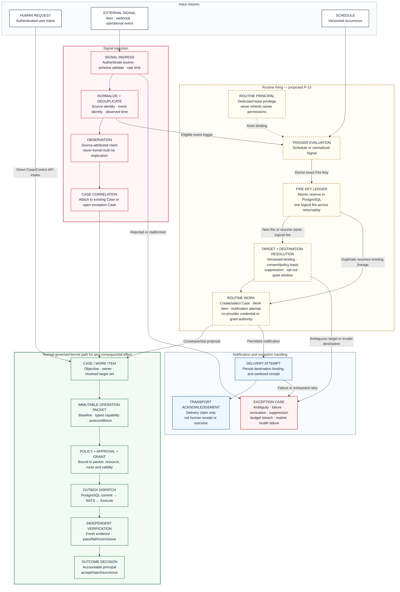

# ClarityIT v2 — Signals and Routines

**Diagram version:** 0.2
**Status:** Proposed target-state companion under Native Pattern P-15; not an approved implementation contract
**Governing constraints:** Product Definition v0.1 and Authoritative Execution Kernel v0.1
**Rendered asset:** [`images/signals-and-routines.png`](images/signals-and-routines.png)

This view separates user work intake, external Signal ingestion, and routine
firing. No alert, webhook, schedule, routine, reasoning output, or transport
acknowledgement may bypass Case accountability or the normal kernel path for a
consequential effect.

## Binding rules

- Human requests enter the Control API/Case path directly; they are not normalized
  as external Signals.
- External Signals are authenticated, schema-validated, deduplicated, and preserved
  as source-attributed Observations before Case correlation.
- Each Routine version executes as a dedicated Routine Principal and reserves one
  deterministic Fire Key atomically before downstream work.
- Target and person-directed destination bindings are versioned and revalidated;
  ambiguity, revocation, suppression, lack of consent/policy basis, or purpose
  mismatch blocks the action and creates or updates an exception Case.
- A routine proposing a consequential effect must create or select a Case and use
  the same packet, policy, approval, grant, outbox, execution, verification, and
  outcome-decision sequence as human-initiated work.
- Transport acceptance is a delivery claim, not proof that a person received,
  read, or acted on a notification.
