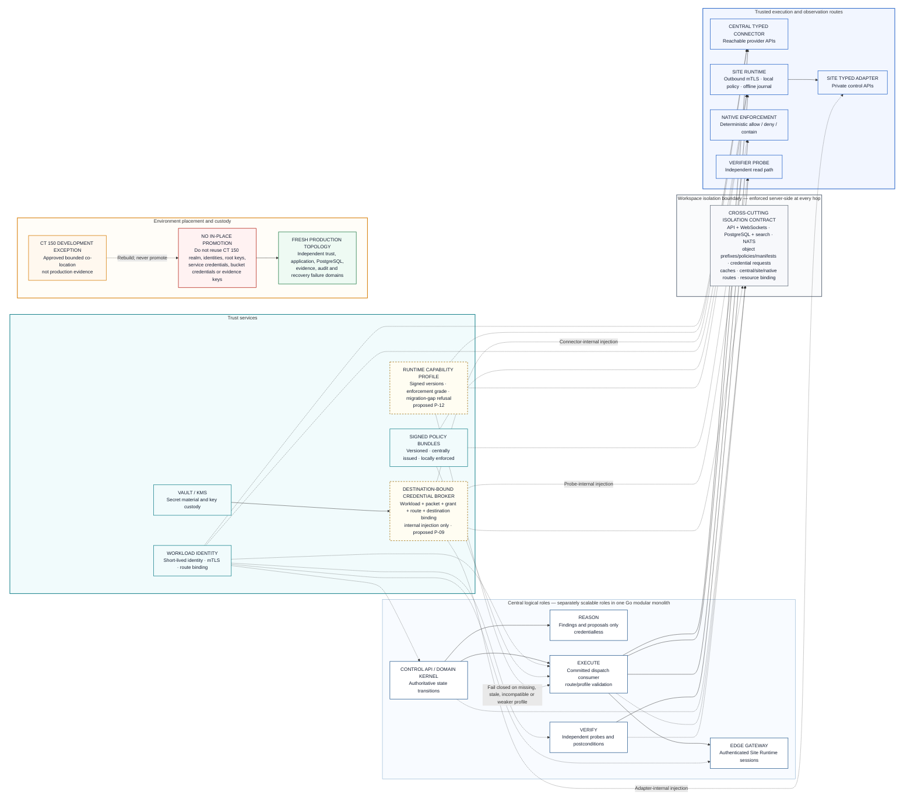

# ClarityIT v2 — Trust and Deployment Topology

**Diagram version:** 0.2
**Status:** Target-state trust companion; deployment placement is governed by the Environment Trust and Evidence Custody Profile v0.1
**Draft dependencies:** Native Pattern P-09 destination-bound credential broker and P-12 Runtime Capability Profile; proposed until separately approved
**Rendered asset:** [`images/trust-and-deployment-topology.png`](images/trust-and-deployment-topology.png)

This diagram expands the cross-plane controls intentionally compressed in the
layered overview. Trust does not flow from a worker's location: each request is
bound to workspace, workload identity, packet, grant, route, destination, policy,
and compatible runtime capabilities.

## Binding rules

- Workload identity authenticates a role; it does not by itself grant an effect.
- Credentials are absent from prompts, packets, browser payloads, messages, logs,
  receipts, evidence exports, and search. A broker resolves and injects a scoped
  credential only within the bound typed adapter, connector, or verifier probe.
- Missing, stale, incompatible, or weaker-than-required runtime capability
  profiles fail closed before route dispatch.
- Workspace isolation is enforced independently across API/WebSockets, product
  state, transport, object bytes, search, credentials, caches, and runtime routes.
- CT 150 is an approved development exception only. Production is provisioned
  fresh across independent trust and evidence-custody failure domains.
