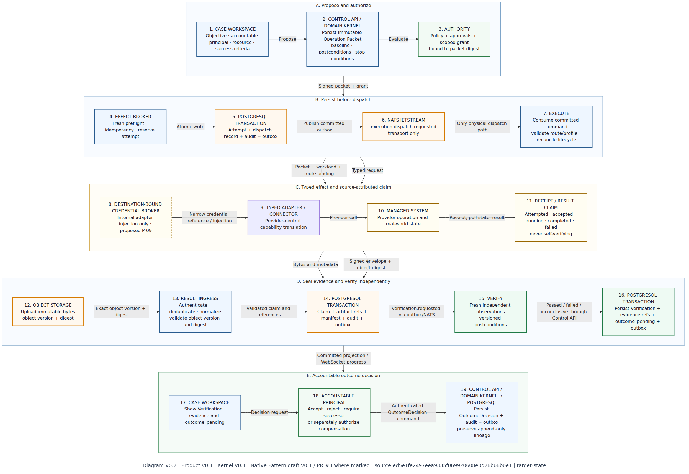
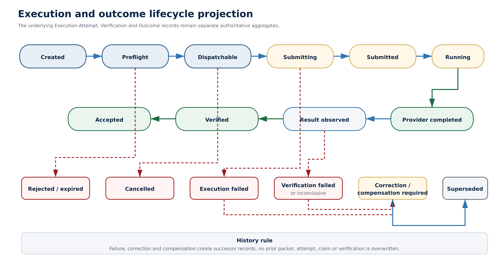

# ClarityIT v2 — Authoritative Execution Kernel

*Canonical semantics for governed effects, verification, and evidence*

**Document type:** Engineering Specification

**Product:** ClarityIT v2

**Version:** 0.1

**Status:** Draft normative specification

**Date:** 30 July 2026

**Applies to:** Control API, execution and verification workers, connectors, Site Runtime, adapters

**Reference slice:** compute.virtual_machine.start with Proxmox VE conformance

> **Specification purpose** Define the one authoritative contract by which ClarityIT turns an immutable proposal into a bounded execution attempt, preserves provider claims without overstating them, evaluates fresh postconditions independently, and records an auditable outcome.

## Normative decision snapshot

- PostgreSQL is the authoritative product-state store. NATS transports commands and events but never creates truth.

- The control plane issues authority. Execution workers and Site Runtimes validate and consume authority but cannot create it.

- An Operation Packet is immutable once proposed and is addressed by a canonical SHA-256 digest.

- Approval and Authority Grant are separate records; approval does not itself provide executable credentials or permission.

- Provider acceptance and provider completion are Result Claims. Verification is a separate record produced from versioned postconditions and fresh observations.

- The execution adapter and verifier are separate interfaces. Compensation is a successor Operation Packet, not a hidden rollback callback.

- The Site Runtime is deterministic, outbound-connected, and unable to plan, grant itself authority, or start a new consequential mutation while disconnected.

- Proxmox-specific fields exist only in the provider profile, external identity, and receipts; the core capability remains compute.virtual_machine.start.

## 1. Authority, scope, and normative language

This specification is normative for every ClarityIT v2 component that creates, authorizes, dispatches, executes, observes, verifies, accepts, or evidences a consequential effect. It resolves ambiguities in the reference architecture and constrains implementation choices. The Product Definition governs why and what the product delivers; this specification governs how execution truth is represented.

### 1.1 Normative terms

| **Term**                | **Meaning**                                                                                 |
|-------------------------|---------------------------------------------------------------------------------------------|
| **MUST / MUST NOT**     | A mandatory conformance requirement.                                                        |
| **SHOULD / SHOULD NOT** | The recommended behavior; deviation requires a recorded design decision and risk rationale. |
| **MAY**                 | An optional behavior that must preserve every invariant.                                    |
| **Authoritative**       | A state that only the owning component and persisted transaction may create.                |
| **Claim**               | A source-attributed report that may be evidence but is not independently proven fact.       |
| **Fresh**               | Observed within the policy-defined window and after the latest relevant causal event.       |

### 1.2 Scope

- Canonical execution-domain objects, identifiers, versions, digests, signatures, and lineage.

- State machines for packets, grants, attempts, verification, outcomes, and the Case lifecycle projection.

- Control-plane, worker, connector, edge-gateway, and Site Runtime write ownership.

- Provider-neutral adapter and independent verifier contracts.

- Command/event envelopes, transactional outbox/inbox, concurrency, idempotency, and recovery.

- Failure, disconnection, cancellation, verification, correction, compensation, and evidence semantics.

- Compute virtual-machine start contract and the first Proxmox VE conformance profile.

### 1.3 Out of scope

Detailed frontend layouts, pricing, tenancy packaging, general workflow authoring, model selection, raw telemetry retention, additional capability schemas, and the full v1-to-v2 data migration are specified elsewhere. This document records only the compatibility consequences required to preserve execution truth.

## 2. Architectural responsibility and ownership

*Figure 1. Authoritative operation sequence: dispatch, evidence sealing,
verification, and outcome decision. Editable source:
[Authoritative Operation Sequence](ClarityIT-v2-Authoritative-Operation-Sequence.md).*

The dashed destination-bound credential-broker node is a proposed P-09
refinement from the Native Pattern draft. It illustrates the existing K-10
credentialless-agent boundary but is not adopted as a detailed implementation
contract by this Kernel version.

| **Component**                   | **Owns**                                                                                                              | **Must not**                                                                      |
|---------------------------------|-----------------------------------------------------------------------------------------------------------------------|-----------------------------------------------------------------------------------|
| **Control API / domain kernel** | Cases, packets, decisions, grants, authoritative transitions, outcome decisions                                       | Create execution claims or call providers directly                                |
| **Authority service**           | Policy decisions, approval requirements, grant issuance/revocation                                                    | Use provider credentials or accept outcomes                                       |
| **Effect broker**               | Preflight authorization, attempt creation, and dispatch record                                                        | Select a route, call a provider, or treat transport delivery as execution success |
| **Execution worker**            | Route selection, dispatch, polling, reconciliation, retry classification, receipt normalization, and attempt progress | Issue authority or mark Verified                                                  |
| **Edge gateway**                | Authenticate Site Runtime sessions; validate and persist inbound envelopes                                            | Publish unpersisted receipts as truth                                             |
| **Receipt / result ingress**    | Authenticate, validate, deduplicate, normalize, and persist source-attributed claims                                  | Convert persistence into Verification or acceptance                               |
| **Site Runtime**                | Local validation, typed execution, local receipt journal, observation spool                                           | Plan work, issue grants, or write central PostgreSQL                              |
| **Verification worker**         | Execute verifier spec and persist Verification results                                                                | Reuse the executor's success flag as proof                                        |
| **Reasoning worker**            | Findings, hypotheses, rationale, structured proposals                                                                 | Write authoritative state or access operational credentials                       |
| **Trust services**              | Workload identity, mutual TLS, short-lived secrets, signed policy bundles, and route binding                          | Expose target credentials to agents                                               |
| **Native enforcement**          | Deterministic local allow, deny, or containment at approved control points                                            | Place an LLM in the enforcement path                                              |
| **Operational sources**         | Telemetry, logs, events, and independent technical or business health inputs                                          | Write kernel truth directly                                                       |
| **PostgreSQL**                  | Authoritative product state and aggregate versions                                                                    | Act as a raw telemetry warehouse                                                  |
| **NATS JetStream**              | Durable transport and fan-out                                                                                         | Become the system of record                                                       |

> **Execution truth invariant** Provider, worker and agent outputs remain source-attributed claims after persistence. Only independent verification can establish a verified result, and only a separate outcome decision can accept it.
>
> **Persist-before-publish rule** Every authoritative transition and accepted inbound receipt MUST commit to PostgreSQL with its outbox record before any corresponding event is published. A consumer MUST deduplicate through an inbox record before applying a command or event.

## 3. Kernel invariants

| **ID**   | **Invariant**                                                                                                                                                                    |
|----------|----------------------------------------------------------------------------------------------------------------------------------------------------------------------------------|
| **K-01** | A proposed Operation Packet is immutable; correction or parameter change creates a successor packet.                                                                             |
| **K-02** | A valid approval is necessary only when policy requires it and is never sufficient without a valid Authority Grant.                                                              |
| **K-03** | A grant is bound to exact workspace, Case, packet digest, resource, capability, constraints, workload identity, route identity, policy revision, validity window, and use limit. |
| **K-04** | No consequential provider call occurs before fresh preflight observation and stop-condition evaluation.                                                                          |
| **K-05** | One logical idempotency key produces at most one provider submission, including across process restarts and duplicate transport delivery.                                        |
| **K-06** | Provider receipt, terminal provider result, and resulting provider state are source-attributed claims, not Verification.                                                         |
| **K-07** | Verified requires a versioned Verification Specification, fresh inputs, and a persisted Verification result.                                                                     |
| **K-08** | Accepted requires an identified principal and cannot be inferred from Verified in the first release.                                                                             |
| **K-09** | No prior packet, decision, attempt, claim, observation, verification, or outcome is overwritten to represent correction.                                                         |
| **K-10** | Agents never receive provider credentials and never write authority, execution, verification, or acceptance state directly.                                                      |
| **K-11** | Site Runtime disconnection does not create authority; new consequential mutation fails closed by default.                                                                        |
| **K-12** | Projection, cache, message, browser, and worker-local state are rebuildable and non-authoritative.                                                                               |

## 4. Canonical domain model

| **Object**           | **Meaning**                                                                                                                        | **Authoritative owner** |
|----------------------|------------------------------------------------------------------------------------------------------------------------------------|-------------------------|
| **Case**             | Governed Work Item that owns objective, accountability, affected resources, success criteria, and execution lineage.               | Domain kernel           |
| **Resource**         | Stable ClarityIT identity for an external system/object plus provider bindings and supported capabilities.                         | Resource registry       |
| **Observation**      | Time-bound, source-attributed statement about selected resource state.                                                             | Observation service     |
| **OperationPacket**  | Immutable proposed effect bound to target, baseline, postconditions, constraints, authority, verifier, and compensation candidate. | Domain kernel           |
| **PolicyDecision**   | Deterministic evaluation of a packet under an exact policy revision.                                                               | Authority service       |
| **ApprovalDecision** | Identified principal's approve/reject decision bound to the packet digest and required context.                                    | Authority service       |
| **AuthorityGrant**   | Scoped, expiring, use-limited permission issued to a workload identity.                                                            | Authority service       |
| **ExecutionAttempt** | One idempotent effort to dispatch and track an authorized packet.                                                                  | Effect broker           |
| **ProviderReceipt**  | Immutable provider or route acknowledgment, progress, terminal result, or error record.                                            | Execution service       |
| **ResultClaim**      | Normalized assertion derived from one or more receipts; never independent proof.                                                   | Execution service       |
| **VerificationSpec** | Versioned machine-checkable postconditions, sources, thresholds, freshness, and evaluation rule.                                   | Domain kernel           |
| **Verification**     | Evaluation of fresh inputs against one VerificationSpec: passed, failed, or inconclusive.                                          | Verification service    |
| **OutcomeDecision**  | Human or policy-authorized acceptance, rejection, correction, or compensation decision.                                            | Domain kernel           |
| **EvidenceManifest** | Canonical append-only index connecting intent, authority, execution, observation, verification, and outcome.                       | Evidence service        |
| **GuardDecision**    | Local deterministic allow, deny, or pre-authorized containment decision at a native enforcement point.                             | Guard integration       |

### 4.1 Common record fields

| **Field**                    | **Type**      | **Constraint**                                            |
|------------------------------|---------------|-----------------------------------------------------------|
| **id**                       | UUIDv7        | Globally unique immutable identifier.                     |
| **workspace_id**             | UUID          | Tenant/workspace boundary; required on every aggregate.   |
| **schema_version**           | integer       | Payload/schema version interpreted by the owning service. |
| **aggregate_version**        | integer       | Monotonic optimistic-concurrency version.                 |
| **created_at / recorded_at** | UTC timestamp | RFC 3339 with sub-second precision.                       |
| **created_by**               | PrincipalRef  | Human, workload, service, or policy identity.             |
| **correlation_id**           | UUID          | Groups one Case or request chain.                         |
| **causation_id**             | UUID          | References the command/event that caused this record.     |
| **supersedes_id**            | UUID?         | Successor lineage; never in-place replacement.            |

### 4.2 Canonical identifiers and addressing

> clarity://workspace/{workspace_id}/case/{case_id}  
> clarity://workspace/{workspace_id}/resource/{resource_id}  
> clarity://workspace/{workspace_id}/operation-packet/{packet_id}  
> clarity://workspace/{workspace_id}/execution-attempt/{attempt_id}

A resource's ClarityIT identifier remains stable when provider display names change. Provider identities are versioned bindings under the Resource and MUST include enough fields to address exactly one external object. Ambiguous or partially resolved identities cannot authorize execution.

## 5. Resource and Observation contracts

### 5.1 Resource

| **Field**                    | **Type**        | **Rule**                                                                      |
|------------------------------|-----------------|-------------------------------------------------------------------------------|
| **resource_type**            | string          | Namespaced type such as compute.virtual_machine.                              |
| **provider_class**           | string          | Compute, Kubernetes, database, SaaS, endpoint, or other class.                |
| **bindings\[\]**             | ProviderBinding | Adapter ID/version, route, external identity, validity, discovery provenance. |
| **owner_refs\[\]**           | PrincipalRef    | Accountable and technical owners.                                             |
| **environment**              | enum            | development, test, staging, production, restricted.                           |
| **capabilities\[\]**         | CapabilityRef   | Adapter-declared supported operations and constraints.                        |
| **resource_version**         | string          | Canonical version/fingerprint used for concurrency and authority binding.     |
| **health_contract_refs\[\]** | URI             | Versioned verifier specifications.                                            |
| **status**                   | enum            | active, quarantined, retired, unresolved.                                     |

### 5.2 Observation

| **Field**             | **Type**   | **Rule**                                                                    |
|-----------------------|------------|-----------------------------------------------------------------------------|
| **resource_id**       | UUID       | Exact target.                                                               |
| **source**            | SourceRef  | Adapter, telemetry system, verifier, operator, or native enforcement point. |
| **observed_at**       | timestamp  | Time state existed at source.                                               |
| **received_at**       | timestamp  | Time ClarityIT accepted the statement.                                      |
| **fieldset**          | string\[\] | Selected normalized fields; not an unbounded raw dump.                      |
| **state**             | object     | Typed normalized values.                                                    |
| **external_revision** | string?    | Provider revision/ETag/resourceVersion when available.                      |
| **fresh_until**       | timestamp  | Derived from policy and source characteristics.                             |
| **fingerprint**       | sha256     | Digest of canonical source, identity, selected state, and revision.         |
| **artifact_refs\[\]** | URI        | Optional raw evidence stored outside the row.                               |

> **Observation rule** Freshness is evaluated at the moment a transition depends on an Observation. A previously fresh baseline does not remain valid merely because its record is immutable.

## 6. Operation Packet

The Operation Packet is the complete approval and execution subject. A draft may be edited. Propose canonicalizes and freezes it, computes its digest, and makes every later decision bind to that digest.

| **Field**                   | **Requirement**                                                                    |
|-----------------------------|------------------------------------------------------------------------------------|
| **packet_id / version**     | Identity and monotonic packet version.                                             |
| **case_id / objective**     | Work context and intended operational outcome.                                     |
| **capability**              | Provider-neutral effect name and version.                                          |
| **resource_ref**            | Stable ClarityIT target identity.                                                  |
| **provider_binding_ref**    | Selected adapter, route, and exact external identity version.                      |
| **baseline_refs\[\]**       | Required Observations and fingerprints.                                            |
| **parameters**              | Typed capability parameters; no secrets.                                           |
| **rationale**               | Human/agent causal explanation with provenance.                                    |
| **predicted_effects\[\]**   | Expected direct and relevant secondary effects.                                    |
| **preconditions\[\]**       | Machine-checkable conditions required before dispatch.                             |
| **postconditions\[\]**      | Machine-checkable expected resulting state.                                        |
| **stop_conditions\[\]**     | Conditions that halt before or during safe points.                                 |
| **risk**                    | Class, factors, blast radius, reversibility, and policy inputs.                    |
| **authority_requirement**   | Policy class, approver roles/count, separation of duties, MFA/step-up if required. |
| **verification_spec_ref**   | Exact versioned independent verifier contract.                                     |
| **compensation_candidate**  | Optional successor capability and prerequisites; never auto-authority.             |
| **valid_from / expires_at** | Packet proposal validity window.                                                   |
| **nonce**                   | Single packet nonce preventing replay across contexts.                             |
| **policy_revision_hint**    | Revision expected at evaluation; final decision records actual revision.           |
| **canonical_digest**        | SHA-256 of canonical payload excluding signatures and mutable metadata.            |
| **signature**               | Control-plane signature envelope and key identifier.                               |

### 6.1 Canonicalization and signature

- Serialize the packet using a deterministic JSON canonicalization profile; reject duplicate object keys, non-finite numbers, and unrecognized critical fields.

- Compute SHA-256 over the canonical packet payload with canonical_digest and signature fields omitted.

- Sign the digest envelope with the organization-approved asymmetric key; v0.1 default is JWS ES256 with explicit key ID and algorithm agility.

- Every validator recomputes the digest and verifies the signature, schema version, expiry, workspace, and nonce before trusting packet contents.

- A provider translation may add execution-local material but cannot change the approved capability, target, parameters, preconditions, or postconditions.

### 6.2 Illustrative packet

> {  
> "schema_version": 1,  
> "packet_id": "018f...c201",  
> "case_id": "018f...a010",  
> "capability": {  
> "name": "compute.virtual_machine.start",  
> "version": 1  
> },  
> "resource_ref": "clarity://workspace/{ws}/resource/{vm}",  
> "baseline_refs": \[  
> {  
> "observation_id": "018f...b901",  
> "fingerprint": "sha256:..."  
> }  
> \],  
> "parameters": {},  
> "preconditions": \[  
> {  
> "path": "\$.power_state",  
> "op": "eq",  
> "value": "stopped"  
> }  
> \],  
> "postconditions": \[  
> {  
> "path": "\$.power_state",  
> "op": "eq",  
> "value": "running"  
> }  
> \],  
> "verification_spec_ref": "clarity://workspace/{ws}/verifier/https-health@3",  
> "expires_at": "2026-07-30T04:10:00Z",  
> "nonce": "base64url(...)",  
> "canonical_digest": "sha256:..."  
> }

## 7. Policy, approval, and Authority Grant

### 7.1 Decision separation

| **Record**              | **Question answered**                                                                 | **Owner**                                |
|-------------------------|---------------------------------------------------------------------------------------|------------------------------------------|
| **PolicyDecision**      | What policy requires or denies for the exact packet and context.                      | Authority service                        |
| **ApprovalDecision**    | Whether an identified human principal approves or rejects the exact packet.           | Human via control API                    |
| **AuthorityGrant**      | Whether a named workload identity may attempt the exact effect within scope and time. | Authority service                        |
| **Execution preflight** | Whether all current conditions still permit dispatch now.                             | Effect broker + selected execution route |
| **OutcomeDecision**     | Whether an accountable principal accepts the verified outcome.                        | Human in first release                   |

### 7.2 Authority Grant fields

| **Field**                              | **Type**                                             | **Constraint**                              |
|----------------------------------------|------------------------------------------------------|---------------------------------------------|
| **grant_id**                           | UUIDv7                                               | Immutable.                                  |
| **packet_digest**                      | sha256                                               | Exact proposal.                             |
| **resource_id / resource_version**     | UUID + string                                        | Exact target and approved baseline version. |
| **capability / parameter_constraints** | typed                                                | No broader effect or values.                |
| **case_id**                            | UUID                                                 | No use outside work context.                |
| **subject_workload_identity**          | SPIFFE-like URI or workload principal                | Executor that may reserve/use the grant.    |
| **route_identity**                     | connector or Site Runtime principal                  | Exact execution trust boundary.             |
| **policy_revision**                    | string                                               | Evaluated policy bundle.                    |
| **approval_decision_refs\[\]**         | UUID                                                 | All required human decisions.               |
| **not_before / expires_at**            | timestamps                                           | Short validity window.                      |
| **max_uses**                           | integer                                              | One for the first release.                  |
| **state**                              | issued \| reserved \| consumed \| revoked \| expired | Transactional state machine.                |
| **reservation_id / reserved_until**    | UUID + timestamp?                                    | Crash-safe dispatch reservation.            |
| **nonce**                              | opaque                                               | Replay protection.                          |

### 7.3 Reservation and consumption

- Preflight atomically reserves the issued grant and creates the Execution Attempt under the same transaction or a serializable equivalent.

- A pre-provider failure releases an unconsumed reservation only when policy permits retry and no external submission could have occurred.

- Once submission begins, the grant is consumed. Ambiguous provider outcomes never return the grant to issued state.

- Duplicate deliveries reuse the existing attempt and provider operation reference; they do not reserve or consume another grant.

- Revocation prevents new reservation. It cannot retroactively erase an already submitted external effect.

## 8. State machines and projections

*Figure 2. Combined execution and outcome lifecycle projection; underlying records remain separate.*

### 8.1 Operation Packet state

| **State**      | **Meaning**                                                   | **Allowed transition**      |
|----------------|---------------------------------------------------------------|-----------------------------|
| **draft**      | Mutable; no digest has authority.                             | propose                     |
| **proposed**   | Canonical, signed, immutable, eligible for policy evaluation. | supersede, withdraw, expire |
| **superseded** | Successor packet exists; no new authority may be issued.      | terminal                    |
| **withdrawn**  | Proposer withdrew before execution.                           | terminal                    |
| **expired**    | Validity ended before dispatch.                               | terminal                    |

### 8.2 Authority Grant state

| **State**    | **Meaning**                                      | **Allowed transition**   |
|--------------|--------------------------------------------------|--------------------------|
| **issued**   | Valid and unused.                                | reserve, revoke, expire  |
| **reserved** | Bound to one attempt for bounded preflight.      | consume, release, revoke |
| **consumed** | Provider submission started or may have started. | terminal                 |
| **revoked**  | No future dispatch.                              | terminal                 |
| **expired**  | Validity window ended.                           | terminal                 |

### 8.3 Execution Attempt state

| **State**              | **Meaning**                                                                       | **Next**                                                           |
|------------------------|-----------------------------------------------------------------------------------|--------------------------------------------------------------------|
| **created**            | Attempt row and idempotency key committed.                                        | preflight                                                          |
| **preflight**          | Freshness, packet, grant, policy, route, and stop conditions are being validated. | dispatchable, blocked, cancelled                                   |
| **dispatchable**       | All checks pass and grant is reserved.                                            | submitting, cancelled                                              |
| **submitting**         | External submission may occur; grant becomes consumed.                            | submitted, provider_failed, outcome_unknown                        |
| **submitted**          | Provider receipt and operation ID persisted.                                      | running, provider_completed, provider_failed, outcome_unknown      |
| **running**            | Provider operation is non-terminal.                                               | provider_completed, provider_failed, outcome_unknown               |
| **provider_completed** | Provider reported terminal success.                                               | terminal attempt state                                             |
| **provider_failed**    | Provider reported terminal failure.                                               | terminal attempt state                                             |
| **blocked**            | Preflight rejected dispatch before provider submission.                           | terminal attempt state                                             |
| **cancelled**          | Cancelled before confirmed provider submission.                                   | terminal attempt state                                             |
| **outcome_unknown**    | Submission may have occurred but cannot be confirmed.                             | reconcile to submitted/completed/failed or remain terminal-unknown |

### 8.4 Verification and outcome states

| **Aggregate**       | **States**                                                                                                                                               | **Rule**                                                        |
|---------------------|----------------------------------------------------------------------------------------------------------------------------------------------------------|-----------------------------------------------------------------|
| **Verification**    | pending -\> running -\> passed \| failed \| inconclusive                                                                                                 | No executor state can skip this machine.                        |
| **OutcomeDecision** | pending -\> accepted \| rejected \| correction_required \| compensation_required                                                                         | Accepted requires passed Verification in first release.         |
| **Case projection** | open -\> investigating -\> decision_pending -\> authorized -\> executing -\> verifying -\> outcome_pending -\> accepted \| correction_required \| closed | A projection over immutable records; not a substitute for them. |

## 9. Dispatch and execution protocol

| **Step**                          | **Authoritative behavior**                                                                                                                                                                    |
|-----------------------------------|-----------------------------------------------------------------------------------------------------------------------------------------------------------------------------------------------|
| **1. Persist proposal**           | Control API stores proposed packet, digest, signature, and outbox event.                                                                                                                      |
| **2. Evaluate authority**         | Authority service stores PolicyDecision, collects approvals, and issues a scoped grant.                                                                                                       |
| **3. Create attempt**             | Effect broker locks packet/resource/grant, records approved route constraints, assigns the idempotency key, and creates the attempt.                                                          |
| **4. Select route and preflight** | Execution worker selects one approved route and adapter, obtains a fresh Observation, and evaluates digest, scope, freshness, preconditions, stop conditions, expiry, and local route policy. |
| **5. Reserve and dispatch**       | Grant reservation and broker dispatch record commit before the broker sends only to the execution worker.                                                                                     |
| **6. Submit**                     | The selected central connector or Site Runtime translates the generic capability and submits exactly once.                                                                                    |
| **7. Persist receipt**            | Route returns signed receipt; edge/control validates and persists it before publishing progress.                                                                                              |
| **8. Track**                      | Worker polls or consumes provider callbacks until terminal result or reconciliation timeout.                                                                                                  |
| **9. Observe result**             | A new read obtains fresh normalized resource state.                                                                                                                                           |
| **10. Verify**                    | Independent verifier evaluates the exact versioned postconditions.                                                                                                                            |
| **11. Decide**                    | Accountable principal accepts, rejects, or opens successor correction/compensation.                                                                                                           |
| **12. Seal evidence**             | Evidence service generates a manifest and digest over the complete lineage.                                                                                                                   |

### 9.1 Route selection

| **Route**        | **Behavior**                                                                          | **Use**                                                      |
|------------------|---------------------------------------------------------------------------------------|--------------------------------------------------------------|
| **central**      | Control-plane execution worker calls a reachable provider or SaaS API.                | Public/reachable APIs; no customer-zone runtime required.    |
| **site**         | Execution command passes through edge gateway to a specific Site Runtime.             | Private API, locality, data residency, or local enforcement. |
| **native_guard** | Signed policy is enforced by an admission, IAM, gateway, database, or OS integration. | Millisecond allow/deny and pre-authorized containment only.  |

Route is a deployment concern bound into the grant and attempt. It MUST NOT appear as a different product capability. Changing route after approval requires re-evaluating policy and issuing a new grant; changing the target adapter binding may require a successor packet when provider translation or risk changes.

## 10. Provider adapter and verifier contracts

### 10.1 Execution adapter

| **Method**               | **Input**                            | **Output / rule**                                                                                    |
|--------------------------|--------------------------------------|------------------------------------------------------------------------------------------------------|
| **DescribeCapabilities** | None / adapter context               | Supported resource types, capability versions, parameter schemas, async/cancel/idempotency behavior. |
| **Observe**              | Resource binding + fieldset          | Source-attributed normalized Observation draft and provider revision.                                |
| **Prepare**              | Packet + fresh Observation           | Validated provider translation, redacted preview, required permissions; no mutation.                 |
| **Submit**               | Prepared operation + idempotency key | ProviderReceipt with accepted/rejected/unknown and provider_operation_id if available.               |
| **Poll**                 | Provider operation reference         | Progress or terminal ProviderReceipt.                                                                |
| **Cancel**               | Provider operation reference         | Confirmed cancelled, not supported, rejected, or unknown.                                            |
| **ObserveResult**        | Resource binding + expected fieldset | Fresh post-effect Observation draft.                                                                 |
| **Reconcile**            | Attempt + known receipts             | Provider-side lookup that resolves accepted-but-unknown without resubmission.                        |

> **Contract separation** Verify is not an execution-adapter method. The verifier consumes a VerificationSpec and fresh evidence through a separate read-only contract. Compensation is a new Operation Packet using an explicitly supported capability; it is never an adapter callback that bypasses authority.

### 10.2 Verifier

| **Method**   | **Requirement**                                                                                     |
|--------------|-----------------------------------------------------------------------------------------------------|
| **Describe** | Verifier type/version, required sources, secrets references, freshness, thresholds, timeout.        |
| **Prepare**  | Resolve non-secret configuration and validate reachability prerequisites without declaring success. |
| **Execute**  | Perform read-only checks and return timestamped evidence items.                                     |
| **Evaluate** | Apply exact versioned rule and return passed, failed, or inconclusive plus reason codes.            |
| **Seal**     | Store artifacts and canonical input/output digests.                                                 |

### 10.3 Adapter conformance requirements

- Declare capability and schema versions and reject unsupported fields; do not silently ignore critical packet fields.

- Normalize provider status into kernel enums without discarding raw provider codes.

- Return accepted-but-unknown when transport failure occurs after submission could have reached the provider.

- Support reconciliation before any resubmission and document the provider's idempotency behavior.

- Redact secrets from previews, receipts, logs, errors, events, and evidence exports.

- Expose adapter identifier, build version, configuration digest, and route identity in every receipt.

## 11. Command and event envelopes

| **Field**                         | **Type**      | **Rule**                                                            |
|-----------------------------------|---------------|---------------------------------------------------------------------|
| **message_id**                    | UUIDv7        | Transport deduplication identity.                                   |
| **message_type**                  | string        | Namespaced command or event name.                                   |
| **schema_version**                | integer       | Envelope payload version.                                           |
| **workspace_id**                  | UUID          | Mandatory tenant partition.                                         |
| **aggregate_type / aggregate_id** | string + UUID | Owning aggregate.                                                   |
| **aggregate_version**             | integer       | Version after event; expected version for command where applicable. |
| **correlation_id / causation_id** | UUID          | Trace and causal chain.                                             |
| **actor**                         | PrincipalRef  | Human, workload, service, or policy source.                         |
| **occurred_at / recorded_at**     | timestamps    | Source time and accepted persistence time.                          |
| **payload_digest**                | sha256        | Canonical payload integrity.                                        |
| **trace_context**                 | object?       | Observability only; never authority.                                |
| **payload**                       | object        | Typed schema; secrets prohibited.                                   |

### 11.1 Required command/event families

| **Name**                          | **Kind** | **Meaning**                                        |
|-----------------------------------|----------|----------------------------------------------------|
| **operation.packet.proposed**     | Event    | Packet immutable and persisted.                    |
| **authority.grant.issued**        | Event    | Grant available but unused.                        |
| **execution.dispatch.requested**  | Command  | Attempt and dispatch record persisted.             |
| **execution.receipt.recorded**    | Event    | Validated provider/route receipt persisted.        |
| **execution.reconcile.requested** | Command  | Resolve ambiguous submission without resubmission. |
| **observation.recorded**          | Event    | Fresh source-attributed state persisted.           |
| **verification.requested**        | Command  | Completed effect requires exact verifier spec.     |
| **verification.completed**        | Event    | Passed, failed, or inconclusive result persisted.  |
| **outcome.decision.recorded**     | Event    | Acceptance, rejection, or successor requirement.   |
| **evidence.manifest.sealed**      | Event    | Canonical evidence index and digest persisted.     |

## 12. Persistence, concurrency, and idempotency

- Use optimistic concurrency through aggregate_version on every authoritative aggregate. A transition MUST state the expected version and fail on mismatch.

- Use database uniqueness on workspace_id + idempotency_key and on the active provider-operation identity where provider semantics permit.

- Write authoritative state, audit transition, and outbox row in one PostgreSQL transaction.

- Each consumer writes inbox(message_id, consumer) before or with its state transition; duplicate delivery returns the recorded result.

- A worker lease is operational coordination only. Losing a lease does not roll back an external provider operation or change authoritative state.

- Poll checkpoints, next_poll_at, attempt count, last receipt, and provider operation ID are durable so another worker can resume.

- Exactly-once external execution is not assumed. ClarityIT provides at-most-one logical submission through durable idempotency, reconciliation, and provider-aware behavior.

### 12.1 Idempotency key

> idempotency_key = sha256(  
> workspace_id \|\| packet_digest \|\| resource_id \|\| capability_version \|\| attempt_lineage_id  
> )

The provider-facing idempotency token MAY be a safe encoding of this key when supported. When unsupported, the adapter MUST document reconciliation semantics and the broker MUST never automatically resubmit after an ambiguous outcome.

## 13. Observation and independent verification

| **ID**   | **Rule**                                                                                                                                   |
|----------|--------------------------------------------------------------------------------------------------------------------------------------------|
| **V-01** | Verification inputs MUST be recorded Observations or evidence items with source, time, schema, and digest.                                 |
| **V-02** | The verifier MUST use the exact VerificationSpec version referenced by the packet.                                                         |
| **V-03** | Freshness MUST be evaluated relative to provider completion and the policy-defined causal window.                                          |
| **V-04** | Executor-written success flags, agent conclusions, and UI state MUST NOT be verification inputs.                                           |
| **V-05** | Provider state MAY satisfy a provider-state postcondition; consequential workload health SHOULD use a different observation path.          |
| **V-06** | A verifier timeout, unreachable source, stale evidence, or missing input produces inconclusive unless the spec explicitly defines failure. |
| **V-07** | Retried probes remain individual evidence items; the final result records the exact aggregation rule.                                      |
| **V-08** | Changing threshold, source, timeout, or rule creates a new VerificationSpec version and requires a successor packet when already proposed. |

### 13.1 First-release HTTPS verifier

| **Element**           | **Pilot contract**                                                                          |
|-----------------------|---------------------------------------------------------------------------------------------|
| **Transport**         | HTTPS only; validate certificate chain, hostname, and configured trust anchors.             |
| **Request timeout**   | 5 seconds per probe.                                                                        |
| **Success predicate** | HTTP status 200-299; optional body predicate must be versioned if enabled.                  |
| **Aggregation**       | Three consecutive successes; any failed probe resets the count.                             |
| **Window**            | 120 seconds after provider completion.                                                      |
| **Result**            | passed, failed, or inconclusive with timestamped probe evidence.                            |
| **Secret handling**   | Authentication secret referenced from secret manager; never embedded in packet or evidence. |

## 14. Failure and recovery semantics

| **Condition**                                  | **Required behavior**                                                  | **State**                     | **Recovery**                                                     |
|------------------------------------------------|------------------------------------------------------------------------|-------------------------------|------------------------------------------------------------------|
| **Stale baseline**                             | Block before dispatch.                                                 | blocked                       | Fresh Observation and successor packet if bound state changed.   |
| **Packet digest/signature mismatch**           | Reject as security failure.                                            | blocked                       | No retry with same bytes; investigate integrity.                 |
| **Policy denial**                              | Do not issue grant.                                                    | no attempt                    | New packet/context or policy exception decision.                 |
| **Expired/revoked grant**                      | Block reservation or route validation.                                 | blocked                       | New authority cycle.                                             |
| **Duplicate command**                          | Return existing attempt/result.                                        | unchanged                     | No provider call.                                                |
| **Transport failure before submission**        | Retry only when adapter proves provider was not reached.               | submitting or blocked         | Bounded retry.                                                   |
| **Failure after submission may have occurred** | Never resubmit automatically.                                          | outcome_unknown               | Reconcile by provider operation lookup or state observation.     |
| **Provider rejection**                         | Persist code and sanitized reason.                                     | provider_failed               | Correction or new authority.                                     |
| **Provider operation timeout**                 | Stop active polling at policy limit but preserve operation reference.  | outcome_unknown               | Background reconciliation; no success claim.                     |
| **Provider terminal failure**                  | Persist terminal receipt and raw code.                                 | provider_failed               | Correction or compensation proposal.                             |
| **Result state mismatch**                      | Persist fresh Observation.                                             | provider_completed + mismatch | Verification cannot pass; correction required.                   |
| **Verifier unavailable/stale input**           | Do not infer pass or fail unless spec says so.                         | inconclusive                  | Retry within window or successor decision.                       |
| **Verification failed**                        | Keep provider completion visible.                                      | failed                        | Human decides correction or compensation.                        |
| **Site Runtime disconnected before dispatch**  | Do not start new consequential mutation.                               | blocked / pending route       | Wait for authenticated session or select newly authorized route. |
| **Site Runtime disconnected after submission** | Continue local poll/spool if possible; central shows unknown progress. | submitted/running/unknown     | Reconcile on reconnect.                                          |
| **Compensation fails**                         | Preserve both original and compensation attempt.                       | compensation_failed           | Escalate; never rewrite original outcome.                        |

> **Unknown is a real state** If submission may have reached the provider but ClarityIT lacks a durable receipt, the correct state is outcome_unknown. It is safer and more accurate than either Failed or Succeeded, and it prevents duplicate mutation.

## 15. Site Runtime and disconnected operation

| **Area**               | **Requirement**                                                                                                      |
|------------------------|----------------------------------------------------------------------------------------------------------------------|
| **Identity**           | Attested workload identity with outbound mTLS; certificate rotation is automatic.                                    |
| **Configuration**      | Signed adapter inventory, policy bundle, route scope, trust roots, and allowed resource bindings.                    |
| **Command validation** | Signature, packet digest, grant, route identity, expiry, nonce, resource binding, local policy, and stop conditions. |
| **Credential access**  | Short-lived target credential obtained locally or through secret broker; never returned to control plane or agent.   |
| **Local journal**      | Encrypted append-only command, receipt, observation, and acknowledgment queue with monotonic local sequence.         |
| **Clock**              | Trusted clock health required for expiry checks; unhealthy clock fails consequential mutation closed.                |
| **Upgrade**            | Signed artifact, staged rollout, rollback to last trusted version, compatibility handshake.                          |
| **No-LLM rule**        | No model runtime, planning loop, prompt, or autonomous capability selection.                                         |

### 15.1 Disconnection matrix

| **Activity**                    | **Disconnected behavior**                                                | **Default**       |
|---------------------------------|--------------------------------------------------------------------------|-------------------|
| **Observe**                     | Continue permitted reads and spool signed Observations.                  | Allowed           |
| **Guard deny**                  | Continue deterministic protective deny policy.                           | Allowed           |
| **Guard containment**           | Only if pre-authorized by signed emergency policy and locally auditable. | Policy-specific   |
| **New consequential mutation**  | Do not begin while disconnected.                                         | Denied by default |
| **Already submitted operation** | Continue provider polling and local receipt journaling when possible.    | Allowed           |
| **New grant or approval**       | Cannot be created locally.                                               | Denied            |
| **Expired packet or grant**     | Cannot be extended or reused locally.                                    | Denied            |

## 16. Security and trust invariants

- Every human and workload action carries an authenticated PrincipalRef. Shared service accounts without workload attribution do not satisfy the kernel.

- Use mTLS between control, edge, and Site Runtime components; bind the runtime identity into the grant and every route receipt.

- Operational credentials are short-lived where supported, least-privilege, target-scoped, and excluded from packets, prompts, logs, events, receipts, and evidence.

- Policy bundles, adapter packages, Site Runtime binaries, and Operation Packets are signed and versioned.

- All secrets in configuration are references resolved at the narrowest trusted execution point.

- The route revalidates packet signature, grant, expiry, nonce, local policy, and target binding even if central preflight passed.

- High-risk policies may require separation of proposer, approver, executor administrator, verifier administrator, and outcome accepter.

- Audit and evidence redaction removes secret values without erasing target identity, decision provenance, failure meaning, or integrity metadata.

- Native guard decisions are deterministic and logged; an LLM may explain or investigate them later but cannot be on the enforcement path.

Trust placement is phase-specific. The CT 150 co-location of development IAM,
KES, evidence storage, and application components is a bounded development
exception under the [Environment Trust and Evidence Custody Deployment Profile
v0.1](ClarityIT_v2_Environment_Trust_and_Evidence_Custody_Deployment_Profile_v0.1.md).
It does not satisfy production separation, independent durability, or disaster
recovery. Production must be provisioned fresh across approved independent
trust and evidence-custody failure domains, without reusing CT 150 identities,
root keys, service credentials, storage credentials, or evidence keys.

## 17. Evidence and audit model

| **Section**      | **Required references**                                                                                            |
|------------------|--------------------------------------------------------------------------------------------------------------------|
| **case**         | Case ID, objective, owner, participants, success criteria.                                                         |
| **resource**     | Stable Resource ID, binding version, environment, owner.                                                           |
| **baselines**    | Observation IDs, timestamps, fields, sources, fingerprints, freshness decisions.                                   |
| **proposal**     | Packet ID/version/digest/signature, rationale, risk, conditions, verifier, compensation candidate.                 |
| **authority**    | PolicyDecision, policy revision, ApprovalDecision(s), AuthorityGrant and state.                                    |
| **execution**    | Attempt, idempotency, route/workload identity, adapter version, receipts, provider operation ID, progress, errors. |
| **result**       | Post-effect Observations and normalized ResultClaim.                                                               |
| **verification** | VerificationSpec version, inputs, probes, evidence, result, reason codes.                                          |
| **outcome**      | Acceptance/rejection/successor decision, principal, time, rationale.                                               |
| **integrity**    | Manifest schema, canonical digest, signature, artifact digests, export time.                                       |

### 17.1 Evidence integrity

- The manifest is an index; large or sensitive artifacts remain in object storage and are referenced by immutable URI and digest.

- Create manifests for accepted, rejected, failed, cancelled, unknown, superseded, compensation-required, and compensated lineages.

- A corrected record does not delete the original. The successor references what it corrects and why.

- Export redaction policy and manifest signature are included so a reviewer can distinguish omitted secret material from absent evidence.

- Evidence retention is workspace policy; deletion or legal hold creates explicit lifecycle records rather than silent disappearance.

## 18. Compute capability contract

### 18.1 Resource schema: compute.virtual_machine

| **Field**               | **Type**                                                           | **Meaning**                               |
|-------------------------|--------------------------------------------------------------------|-------------------------------------------|
| **power_state**         | stopped \| starting \| running \| stopping \| suspended \| unknown | Normalized lifecycle state.               |
| **provider_state_raw**  | string                                                             | Unmodified provider status.               |
| **provider_revision**   | string?                                                            | Provider version/ETag when available.     |
| **identity**            | provider binding                                                   | Exact adapter-specific external identity. |
| **environment**         | enum                                                               | Pilot requires non-production.            |
| **health_contract_ref** | URI                                                                | Exact verifier version.                   |

### 18.2 Capability: compute.virtual_machine.start@1

| **Element**                   | **Contract**                                                                                                |
|-------------------------------|-------------------------------------------------------------------------------------------------------------|
| **Parameters**                | None in v0.1; resource binding addresses the VM.                                                            |
| **Required baseline**         | power_state=stopped; Observation age \<= 30 seconds at submission.                                          |
| **Direct effect**             | Request provider to start the exact VM.                                                                     |
| **Provider completion**       | Conforming adapter's terminal success condition.                                                            |
| **Expected result state**     | Fresh Observation reports power_state=running.                                                              |
| **Independent postcondition** | Configured workload health Verification passes.                                                             |
| **Stop conditions**           | Target/version mismatch, not stopped, authority invalid, packet expired, route mismatch, local policy deny. |
| **Idempotency**               | One logical start submission per attempt lineage.                                                           |
| **Cancellation**              | Guaranteed only before submission; provider behavior after submission is profile-specific.                  |
| **Compensation candidate**    | compute.virtual_machine.stop may be proposed separately; not included or automatic in first release.        |

## 19. Proxmox VE conformance profile

| **Element**               | **Mapping**                                                                              | **Rule**                                  |
|---------------------------|------------------------------------------------------------------------------------------|-------------------------------------------|
| **profile_id**            | proxmox-ve.compute@1                                                                     | Adapter/profile identifier.               |
| **resource binding**      | cluster, node, vm_type=qemu, vmid                                                        | All required; exact target.               |
| **Observe**               | Read current QEMU VM status and selected identity.                                       | Map stopped/running; preserve raw status. |
| **Prepare**               | Validate node/type/VMID, permission scope, API reachability, and stopped baseline.       | No mutation.                              |
| **Submit**                | POST provider start action for exact node/qemu/VMID.                                     | Persist returned UPID.                    |
| **provider_operation_id** | UPID                                                                                     | Opaque; never parse for authority.        |
| **Poll**                  | Read task state for exact node and UPID.                                                 | running or stopped plus exit status.      |
| **Terminal success**      | Task stopped and exit status OK.                                                         | Provider-completed ResultClaim only.      |
| **Terminal failure**      | Task stopped and exit status not OK.                                                     | Provider failure with raw code.           |
| **ObserveResult**         | Fresh VM status read.                                                                    | Must normalize to power_state=running.    |
| **Reconcile**             | Lookup known UPID; if absent, observe VM and provider task history without resubmitting. | May remain outcome_unknown.               |
| **Credential scope**      | Read target state, start target, read task status only.                                  | No stop/delete/migrate/configure.         |

### 19.1 Conformance boundary

The existing v1 Proxmox interface and provider-prefixed routes remain compatibility surfaces during migration. They MUST be translated internally to generic v2 Resource and capability semantics. ADR-021's decision to keep provider-prefixed public v1 actions does not govern the v2 domain model and is superseded at the v2 product boundary, while compatibility aliases may remain until retired.

## 20. v1-to-v2 compatibility consequences

| **v1 object**             | **v2 treatment**                             | **Migration rule**                                                              |
|---------------------------|----------------------------------------------|---------------------------------------------------------------------------------|
| **assets**                | Resource plus ProviderBinding                | Preserve object ID where safe; generate stable Resource ID and binding version. |
| **proxmox.start action**  | compute.virtual_machine.start capability     | Keep v1 route as compatibility adapter; store generic capability in v2 ledger.  |
| **approval_requests**     | PolicyDecision + ApprovalDecision references | Do not treat action_type/JSON target as sufficient binding.                     |
| **agent_effect_results**  | ResultClaim                                  | Never migrate synthetic success as verified outcome.                            |
| **remediation_proposals** | OperationPacket draft/proposal candidate     | Canonicalize and freeze only after required fields exist.                       |
| **remediation_steps**     | Planned capability operations                | No synthetic execution success.                                                 |
| **asset_actions**         | ExecutionAttempt + ProviderReceipt           | Existing succeeded may be provider claim only; preserve provenance.             |
| **action_outcomes**       | OutcomeDecision migration candidate          | Operator text cannot become Verification.                                       |
| **outbox events**         | Versioned v2 envelopes                       | Legacy events remain history; new writes use persist-before-publish rule.       |

> **Historical truth rule** Existing records that reported success without provider completion and independent verification MUST retain their original claim semantics. Migration may classify them as legacy_unverified; it MUST NOT manufacture Verified or Accepted history.

## 21. Conformance and acceptance tests

Conformance is layered. A provider profile cannot compensate for a failing kernel, and a passing kernel does not prove a provider adapter. Every applicable layer must pass.

| **Layer**                    | **Required coverage**                                                                                               |
|------------------------------|---------------------------------------------------------------------------------------------------------------------|
| **Kernel transition tests**  | All legal and illegal packet, grant, attempt, verification, outcome, and successor transitions.                     |
| **Persistence tests**        | Optimistic concurrency, outbox/inbox atomicity, duplicate delivery, restart, lease loss, and replay.                |
| **Security tests**           | Digest/signature, scope mismatch, expiry, nonce replay, route identity, secret redaction, separation of duties.     |
| **Adapter contract tests**   | Describe, observe, prepare, submit, poll, cancel, result observation, reconciliation, raw-code preservation.        |
| **Verifier contract tests**  | Freshness, exact spec version, pass/fail/inconclusive, retry aggregation, secret handling, evidence sealing.        |
| **Site Runtime tests**       | mTLS identity, local policy, command validation, encrypted queue, clock failure, disconnection, reconnect, upgrade. |
| **Compute capability tests** | Stopped baseline, start semantics, running result, HTTPS health, compensation boundary.                             |
| **Proxmox profile tests**    | QEMU identity, UPID receipt, task polling, exit status, result read, permission boundary, live pilot.               |
| **End-to-end Case tests**    | Happy path plus product acceptance criteria and evidence reconstruction.                                            |

### 21.1 Mandatory kernel scenarios

| **ID**    | **Scenario**                                                                                                                                   |
|-----------|------------------------------------------------------------------------------------------------------------------------------------------------|
| **KT-01** | Happy path: propose -\> approve -\> grant -\> dispatch -\> provider complete -\> observe -\> verify -\> human accept.                          |
| **KT-02** | Packet modification after proposal creates a successor and invalidates prior approval/grant.                                                   |
| **KT-03** | Stale baseline and changed resource version block before provider submission.                                                                  |
| **KT-04** | Policy denial, rejected approval, expired grant, revoked grant, subject mismatch, route mismatch, and nonce replay each block.                 |
| **KT-05** | Concurrent duplicate commands create one attempt and at most one provider submission.                                                          |
| **KT-06** | Process restart during polling resumes from persisted provider operation reference without resubmission.                                       |
| **KT-07** | Transport failure after possible provider acceptance produces outcome_unknown and reconciliation, not automatic retry.                         |
| **KT-08** | Provider-completed success with result-state mismatch cannot become Verified.                                                                  |
| **KT-09** | Provider running state with failed HTTPS health produces failed or inconclusive Verification and no Accepted outcome.                          |
| **KT-10** | Verifier unavailable produces inconclusive unless the spec explicitly defines failure.                                                         |
| **KT-11** | Cancellation before submission prevents provider call; after submission preserves true provider state.                                         |
| **KT-12** | Correction and compensation create successors and preserve original lineage.                                                                   |
| **KT-13** | Site Runtime disconnect before dispatch blocks mutation; disconnect after submission preserves local polling/spooling and central uncertainty. |
| **KT-14** | Secret scanning proves no provider credential in packets, prompts, client payloads, logs, events, receipts, or evidence.                       |
| **KT-15** | A reviewer reconstructs the complete decision and evidence chain from the sealed manifest.                                                     |
| **KT-16** | Migration classifies legacy synthetic or premature success as unverified and never manufactures verification.                                  |

### 21.2 Release gate

> **Kernel gate** The kernel is accepted only when all invariants, transition tests, persistence and security scenarios, generic compute contract tests, Proxmox live-pilot conformance tests, and Product Definition first-release criteria pass under blocking CI with repeatable installation and upgrade.

## Appendix A. Reason-code taxonomy

| **Prefix**           | **Use**                                                                                                    |
|----------------------|------------------------------------------------------------------------------------------------------------|
| **AUTH\_\***         | Policy, approval, grant, identity, scope, expiry, replay, or separation-of-duties failure.                 |
| **PRECONDITION\_\*** | Baseline freshness, resource version, state, stop condition, or route readiness failure.                   |
| **SUBMISSION\_\***   | Preparation, credential, transport-before-send, provider rejection, or ambiguous send.                     |
| **PROVIDER\_\***     | Running, terminal success, terminal failure, timeout, cancellation, or reconciliation result.              |
| **OBSERVATION\_\***  | Source unavailable, stale, schema mismatch, target mismatch, or result-state mismatch.                     |
| **VERIFICATION\_\*** | Passed, failed predicate, timeout, unavailable source, stale input, TLS, DNS, connection, or inconclusive. |
| **OUTCOME\_\***      | Accepted, rejected, correction required, compensation required, or superseded.                             |
| **EVIDENCE\_\***     | Artifact missing, digest mismatch, redaction applied, manifest sealed, or retention event.                 |
| **SITE\_\***         | Disconnected, clock unhealthy, local policy deny, queue full, identity invalid, or version incompatible.   |

## Appendix B. Required follow-on specifications

| **Artifact**                               | **Purpose**                                                                                                  |
|--------------------------------------------|--------------------------------------------------------------------------------------------------------------|
| **v1-to-v2 Compatibility Specification**   | Exact schema mapping, migration order, compatibility APIs, cutover, rollback, and historical classification. |
| **Generic Compute Adapter Specification**  | Complete normalized resource schemas and capability profiles beyond start.                                   |
| **Proxmox VE Adapter Profile**             | Request/response mappings, permissions, TLS, task reconciliation, test fixtures, and live-pilot runbook.     |
| **Site Runtime Protocol**                  | Handshake, envelope signatures, sequence/acknowledgment, offline queue, upgrades, and attestation.           |
| **First-Release Experience Specification** | Screen states, permissions, user language, receipts, errors, and accessibility acceptance.                   |
| **Evidence Retention and Export Policy**   | Workspace retention, legal hold, redaction, key rotation, export verification, and deletion evidence.        |
| **Native Pattern Specification**           | Reusable governed-work patterns and conformance requirements that preserve kernel invariants.                |
| **Environment Trust and Evidence Custody Deployment Profile** | Phase-specific trust placement, custody controls, and no-in-place promotion boundary.       |
| **Delivery Roadmap**                       | Package dependencies and release gates; cannot weaken kernel semantics.                                     |
