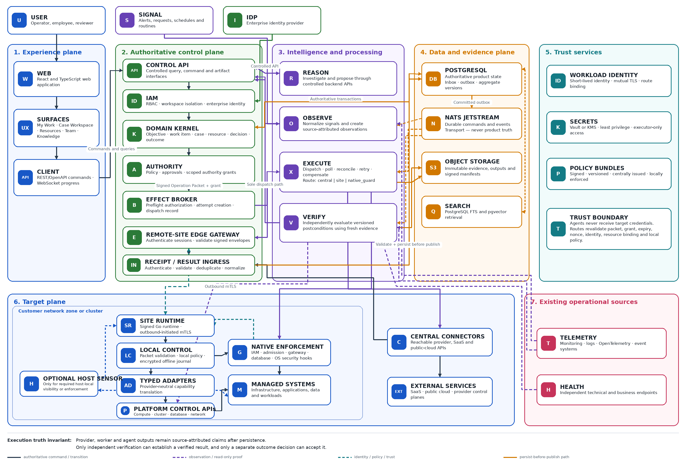

# ClarityIT v2 — Product Definition

*The trusted operating layer for consequential digital work*

**Document type:** Product Definition

**Version:** 0.1 - revised architecture-aligned draft

**Status:** Draft for product and architecture alignment

**Date:** 30 July 2026

**Initial market:** IT operations teams accountable for real systems

**Product promise:** From operational intent to verified outcome

**First release:** Verified virtual-machine recovery through a governed compute adapter

> **Product definition** ClarityIT v2 is the AI-native operational workspace in which people and agents understand an objective, decide what may be done, carry out authorized work across real systems, independently verify the resulting outcome, and retain the evidence and reviewed knowledge produced by the work.

## Decision snapshot

- Build ClarityIT v2 on the existing ClarityIT platform; stabilize and refactor rather than restart from a blank codebase.

- Define product capabilities independently from provider implementations. Proxmox VE is the first compute-adapter conformance profile, not the product boundary.

- Centralize intelligence, policy, authority, and authoritative product state; distribute deterministic observation and execution only where locality requires it.

- Use a constrained Site Runtime per network zone or cluster when direct connectors are insufficient. Do not install an AI agent on every target by default.

- Treat agent output, executor output, and provider completion as claims. Only source-attributed observation and versioned postcondition checks can produce Verified.

- Prove one provider-neutral compute capability end to end before expanding adapters, effects, surfaces, or general work-management breadth.

## 1. Purpose, authority, and revision

This document freezes the v0.1 product definition for ClarityIT v2. It is the product authority for experience design, domain modeling, architecture, migration, implementation planning, and release acceptance. The Authoritative Execution Kernel Specification v0.1 is normative for execution semantics; this document remains authoritative for product scope and user outcome.

This revision incorporates the provider-neutral architecture, the target-side runtime decision, the distinction between operational response and immediate enforcement, and the separation of kernel, compute-adapter, and Proxmox conformance criteria. It intentionally keeps the pilot narrow while preventing a pilot provider from defining the product.

| **Revision**      | **Change**                                                                                                                                           | **Status**                                |
|-------------------|------------------------------------------------------------------------------------------------------------------------------------------------------|-------------------------------------------|
| **Original v0.1** | Defined the product, Case experience, and a verified Proxmox VM-start pilot.                                                                         | Superseded within the same draft version. |
| **Revised v0.1**  | Makes the product and release provider-neutral; adds the three-plane configuration, Site Runtime, guard loop, distribution, and kernel relationship. | Current.                                  |

> **Binding distinction** ClarityIT governs capabilities. Provider adapters translate those capabilities. A deployment route decides where deterministic execution runs. None of those implementation choices changes the product promise or the approved operation.

## 2. Vision, category, and promise

### 2.1 Vision

To create the trusted workspace where people and AI agents work as an operational team - sharing understanding, coordinating decisions, acting across real systems, and proving outcomes - while keeping authority, accountability, and control explicit.

### 2.2 Category

ClarityIT v2 is an AI-native operational workspace and trusted operating layer for consequential digital work.

It is not primarily a chat application, terminal, ITSM suite, task tracker, automation engine, monitoring platform, or agent orchestration framework. It brings the useful parts of those categories into one accountable path from intent to proven outcome.

### 2.3 Product promise

> **Promise** From operational intent to verified outcome.

### 2.4 Long-term direction

ClarityIT is the IT-operations edition and technical foundation of a broader shared work environment. The same model can later support cybersecurity, software delivery, data, identity, financial, customer, compliance, and regulated operational workflows. Everyday employee tasks, projects, and routines use lighter controls until consequence or exception requires a governed Case.

## 3. Problem, users, and value

Operators are accountable for outcomes but assemble work across disconnected alerts, tickets, dashboards, terminals, documents, scripts, approval systems, and automation tools. Context fragments, decisions lose rationale, execution is difficult to supervise, and a successful command is often mistaken for a successful outcome.

| **Problem**                              | **Current condition**                                                     | **Consequence**                                         |
|------------------------------------------|---------------------------------------------------------------------------|---------------------------------------------------------|
| **Fragmented understanding**             | State, history, topology, discussion, ownership, and evidence live apart. | Slow diagnosis and repeated context reconstruction.     |
| **Delegation without bounded authority** | Agents or automations receive broad credentials or ad hoc approval.       | Excessive blast radius and unclear responsibility.      |
| **Output mistaken for outcome**          | HTTP success, provider acceptance, or exit code is treated as proof.      | Partial or ineffective changes are reported as success. |
| **Weak correction path**                 | Recovery is improvised and prior attempts are overwritten.                | Longer incidents and risky repeated actions.            |
| **Experience does not compound**         | Resolved work remains in chats, tickets, and individual memory.           | The next operator repeats the investigation.            |

### 3.1 Primary and participating users

| **Participant**                        | **Role in the product**                                                                 |
|----------------------------------------|-----------------------------------------------------------------------------------------|
| **Accountable operator**               | Owns the system outcome; investigates, supervises, and accepts or rejects the result.   |
| **Resource or service owner**          | Supplies constraints and authorizes effects on the resource.                            |
| **Reviewer or approver**               | Makes an explicit governance decision under delegated authority.                        |
| **Manager or incident commander**      | Coordinates priority, ownership, communication, and intervention.                       |
| **Security or compliance participant** | Defines or verifies policy, evidence, separation of duties, and exceptions.             |
| **AI agent**                           | Investigates, reasons, and proposes within bounded context; holds no target credential. |

### 3.2 Core user job and value

> **Job to be done** Help me understand what is happening, determine what should be done, perform it safely, and prove that the intended outcome was achieved.

**Value** A reliable way to delegate meaningful operational work to AI without surrendering authority, visibility, credentials, or accountability.

## 4. One work model with proportional governance

> Objective -\> Work Item -\> Plan -\> Human and agent actions  
> -\> Deliverable or external effect -\> Verification -\> Outcome

**Work Item.** The common coordination object carrying objective, owner, participants, context, status, relationships, discussion, deliverables, and outcome.

**Case.** The governed work mode used when investigation, uncertainty, consequential action, evidence, or independent verification matters.

| **Level**         | **Example**                                                                 | **Required control**                                                            |
|-------------------|-----------------------------------------------------------------------------|---------------------------------------------------------------------------------|
| **Assisted**      | Draft a summary or query read-only information.                             | Identity, provenance, confirmation where needed.                                |
| **Collaborative** | Complete a team deliverable or maintain a shared plan.                      | Owner, due state, review, and versioned output.                                 |
| **Controlled**    | Publish an official document or change a non-production resource.           | Named reviewer, approved version, scoped authority.                             |
| **Consequential** | Start a production workload, deploy code, issue a refund, or revoke access. | Immutable packet, fresh state, approval, evidence, verification.                |
| **Critical**      | Organization-wide revocation or irreversible data action.                   | Separation of duties, strict freshness, recovery, and independent verification. |

> **Governance rule** Control intensity is determined by the proposed effect, target, environment, reversibility, and policy - not by forcing every task through production-grade workflow.

## 5. Product experience

### 5.1 Core experience loop

1.  Open the work context with an objective, accountable owner, affected resources, and success criteria.

2.  Observe the baseline and assemble relevant topology, history, telemetry, documentation, and prior experience.

3.  Investigate through permitted read-only actions; show sources, uncertainty, and competing explanations.

4.  Propose an immutable Operation Packet with rationale, predicted result, risk, stop conditions, verification, and compensation candidate.

5.  Evaluate policy and obtain scoped authority and any required human decision.

6.  Execute through a trusted route while exposing progress, receipts, and intervention controls.

7.  Observe the resource again and independently evaluate versioned postconditions.

8.  Accept the outcome, create a successor correction, or separately authorize compensation.

9.  Preserve the evidence record and submit knowledge or playbook candidates for review.

### 5.2 Product surfaces

| **Surface**        | **Purpose**                                                                                   | **Availability**               |
|--------------------|-----------------------------------------------------------------------------------------------|--------------------------------|
| **My Work**        | Cases, approvals, exceptions, agent-prepared work, reviews, blockers, and commitments.        | First release                  |
| **Case Workspace** | Objective, discussion, investigation, plan, authority, execution, verification, and evidence. | First release                  |
| **Resources**      | Stable identities, relationships, state, ownership, capabilities, and health contracts.       | First release                  |
| **Team**           | Shared objectives, ownership, dependencies, activity, and intervention needs.                 | Lightweight first release      |
| **Knowledge**      | Reviewed operational knowledge and provenance-bound context.                                  | Attached context first release |
| **Projects**       | Milestones, dependencies, decisions, and linked Work Items oriented around outcomes.          | Later expansion                |
| **Routines**       | Triggered recurring procedures that confirm normal completion or open an exception Case.      | Later expansion                |

### 5.3 Experience authority

Conversation coordinates work; it does not grant permission. Agent reasoning explains a proposal; it does not create facts. An executor reports what it attempted; it does not prove success. The Case Workspace shows all of these while preserving their different authority and evidentiary meaning.

## 6. Recommended product configuration

> **Architecture rule** Centralize intelligence and authority; distribute deterministic observation and execution.

*Figure 1. ClarityIT v2 layered provider-neutral reference architecture (target state).*

> **Execution truth invariant** Provider, worker and agent outputs remain source-attributed claims after persistence. Only independent verification can establish a verified result, and only a separate outcome decision can accept it.

Scope note: the figure is the target architecture. Site Runtime, Native Enforcement, and the Optional Host Sensor are not part of WP-00 or the initial central-route Proxmox slice.

### 6.1 Experience plane

One React and TypeScript web/PWA workspace uses REST/OpenAPI for commands and queries and WebSocket updates for live timelines and execution progress. Drafts may use optimistic UI; decisions, grants, execution states, and verification results never do.

### 6.2 Authoritative control plane

A Go modular monolith owns IAM, workspace isolation, domain state, policy coordination, approvals, authority grants, effect dispatch, lifecycle transitions, and evidence references. It runs as separately scalable API, execution, observation, verification, and edge-gateway roles without fragmenting the domain into independent microservices.

### 6.3 Data and evidence plane

| **Component**                    | **Responsibility**                                                                                              | **Truth status**               |
|----------------------------------|-----------------------------------------------------------------------------------------------------------------|--------------------------------|
| **PostgreSQL**                   | Authoritative product state, aggregate versions, authority, attempts, decisions, audit, and knowledge metadata. | System of record               |
| **NATS JetStream**               | Durable commands and events between runtime roles.                                                              | Transport; never product truth |
| **S3-compatible object storage** | Immutable outputs, snapshots, evidence artifacts, and manifests.                                                | Evidence bytes                 |
| **PostgreSQL FTS + pgvector**    | Knowledge retrieval and context selection.                                                                      | Derived retrieval              |
| **External managed system**      | Actual infrastructure, application, account, or data state.                                                     | Authoritative real-world state |

ClarityIT does not become a raw telemetry warehouse. Existing monitoring, logging, tracing, and event platforms remain sources; ClarityIT preserves only observations, evidence, and source references needed to understand and prove the work.

### 6.4 Trust services and operational sources

Workload identity, mutual TLS, short-lived executor credentials, signed policy bundles, and route binding cross the planes without giving agents target credentials. Existing telemetry and health endpoints remain source-attributed operational inputs; they do not write kernel truth directly.

## 7. Intelligence, target runtimes, and enforcement

### 7.1 Central reasoning workers

- Investigator, planner, case assistant, and knowledge-curator roles run in isolated workers.

- They receive bounded context and return structured proposals and artifacts through controlled backend interfaces.

- They possess no infrastructure credential, cannot bypass policy, and cannot declare their own work verified.

- Verification is deterministic whenever the postcondition can be tested deterministically.

### 7.2 Site Runtime

Deploy one signed Go Site Runtime per network zone, data center, or Kubernetes cluster only when the control plane cannot safely reach target control APIs. It maintains an outbound-initiated mTLS session, validates signed Operation Packets, evaluates local policy, obtains short-lived credentials, executes typed adapters, and returns receipts and observations through an encrypted queue.

> **Non-agent boundary** The Site Runtime is a constrained deterministic executor. It contains no LLM, does not plan work, does not issue grants, and cannot broaden its own privileges.

### 7.3 Host-level component placement

| **Target class**                     | **Preferred control point**                               | **Host component**                                            |
|--------------------------------------|-----------------------------------------------------------|---------------------------------------------------------------|
| **Virtualization and cloud compute** | Provider API adapter                                      | No guest agent by default                                     |
| **Linux and Windows fleets**         | Site Runtime using constrained remote-management channels | Host sensor only for required local visibility or enforcement |
| **Kubernetes**                       | Cluster controller and admission integration              | No per-pod ClarityIT agent                                    |
| **Databases**                        | Site Runtime using constrained database identity          | No host component by default                                  |
| **SaaS platforms**                   | Central API connector                                     | No target installation                                        |
| **Employee endpoints**               | Explicitly enrolled endpoint service                      | Only for approved endpoint capabilities                       |

### 7.4 Continuous monitoring and immediate enforcement

**Operational loop.** Signal -\> Case -\> investigation -\> proposal -\> authority -\> execution -\> verification -\> acceptance or correction.

**Guard loop.** Attempt or protected state change -\> local deterministic policy -\> native enforcement point -\> allow, deny, contain, or open an exception Case.

No language model participates in the millisecond enforcement path. ClarityIT can govern every operation passing through its broker. Preventing out-of-band changes requires the system's native enforcement point, such as IAM, an admission controller, gateway, database permission layer, or OS security hook.

During disconnection, observation and protective deny rules continue and spool locally. New consequential mutations fail closed by default. A Site Runtime may continue polling and reporting an already-submitted provider operation, but it does not convert expired or absent authority into permission.

## 8. Governing principles and truth boundaries

**One shared understanding.** People and agents work from the same objective, scoped resources, current evidence, and operational history.

**Intent before execution.** The desired outcome and acceptance conditions are defined before provider calls are selected.

**Authority is explicit.** Every consequential effect occurs under identifiable, scoped, expiring, and reviewable authority.

**Claims are not facts.** Conversation, reasoning, tool output, and provider receipts retain their source and status.

**Outcomes outrank outputs.** Provider completion is not the final state; independently evaluated postconditions are.

**Credentials stay with trusted executors.** Agents request capabilities; connectors and Site Runtimes use credentials.

**Corrections preserve history.** Rejected, failed, or superseded attempts remain immutable; correction is a successor.

**Learning requires review.** Experience can propose knowledge or playbooks but cannot silently become authority.

**External resources remain authoritative.** ClarityIT records observations; it does not replace the managed system as real-world truth.

| **Boundary**          | **Contains**                                                          | **Meaning**                            |
|-----------------------|-----------------------------------------------------------------------|----------------------------------------|
| **Workspace journal** | Discussion, findings, hypotheses, and collaboration events.           | Context; not authority by itself       |
| **Authority ledger**  | Packets, policies, grants, decisions, attempts, and transitions.      | Authoritative governance record        |
| **Evidence store**    | Manifests, diffs, outputs, receipts, and verifier artifacts.          | Evidence with provenance and integrity |
| **External resource** | Actual infrastructure, application, account, data, or provider state. | Authoritative real-world state         |
| **Projections**       | Timelines, dashboards, notifications, search, and summaries.          | Derived and rebuildable                |

## 9. Product scope and boundaries

### 9.1 In scope for the v2 foundation

- Stabilize the existing Go, PostgreSQL, React, IAM, audit, outbox, storage, real-time, worker, knowledge, and provider-boundary foundations.

- Establish Work Item and Case as the coherent model for coordinated and consequential work.

- Add typed Resources, Observations, Operation Packets, Authority Grants, Execution Attempts, Provider Receipts, Result Claims, Verifications, Outcome Decisions, and Evidence Manifests.

- Rebuild effect semantics so authorization, dispatch, provider completion, observation, verification, and acceptance remain distinct.

- Support direct connectors and the Site Runtime deployment model without exposing route details as product capabilities.

- Deliver My Work, Case Workspace, and Resources around the first verified operational workflow.

### 9.2 Explicit non-goals for the first release

- Replacing general-purpose project-management, ITSM, chat, documentation, monitoring, or automation suites.

- Supporting every compute effect, more than one capability, or more than one provider conformance profile.

- Adding SSH, Kubernetes, database, public-cloud, browser, desktop, Git, or GitHub mutation paths.

- Installing a ClarityIT AI agent inside the target virtual machine.

- General multi-agent swarms, peer-to-peer synchronization, decentralized identity, or custom source-control hosting.

- Autonomous production remediation without the authority and acceptance rules defined by policy.

- Automatic authoritative playbook generation from unreviewed cases.

- A generalized no-code workflow builder, marketplace, billing system, or external customer portal.

| **Treatment**          | **Capabilities**                                                                                                                                                   |
|------------------------|--------------------------------------------------------------------------------------------------------------------------------------------------------------------|
| **Retain**             | Go modular monolith, PostgreSQL, React foundation, IAM, teams, RBAC, MFA, audit, outbox, idempotency, storage, WebSockets, isolated workers, documents, knowledge. |
| **Evolve**             | Object spine, work items, incidents, projects, assets/resources, agent identities, context graph, provider interfaces, navigation.                                 |
| **Replace internally** | Synthetic tool success, remediation simulation, tool-name-only grants, weak approval binding, overwriteable outcomes, provider-prefixed product capabilities.      |
| **Add**                | Execution kernel, observation freshness, resource scope, direct/Site routes, independent verification, receipts, evidence manifests, compensation lineage.         |

## 10. Product delivery and distribution

### 10.1 Initial distribution

| **Component**                | **Artifact**                                            | **Deployment position**                                       |
|------------------------------|---------------------------------------------------------|---------------------------------------------------------------|
| **Control plane**            | Signed OCI container images                             | Production Helm chart; Compose for development and evaluation |
| **Web application**          | OCI image served behind customer ingress                | Same release train as control API                             |
| **Site Runtime**             | Signed Linux package/binary and Windows service package | Per zone or cluster only when needed                          |
| **Kubernetes-local runtime** | Signed image plus manifests/controller packaging        | Cluster-scoped deployment                                     |
| **Supply-chain evidence**    | SBOM, provenance, signatures, version manifest          | Required for every release                                    |

### 10.2 Delivery sequence

1.  Stabilize migrations and restore blocking, green backend CI.

2.  Approve the Authoritative Execution Kernel Specification v0.1.

3.  Introduce v2 objects and state transitions alongside the existing object spine.

4.  Implement the generic compute.virtual_machine.start capability and adapter contract.

5.  Harden the Proxmox VE conformance profile end to end, including polling, fresh observation, and external verification.

6.  Build My Work, Case Workspace, and Resource detail around that real workflow.

7.  Run the non-production pilot and satisfy every mandatory product and kernel criterion.

8.  Only then implement the Site Runtime for a private-network/SSH slice and broaden Projects, Routines, Team, and Knowledge.

## 11. First release: verified virtual-machine recovery

### 11.1 Release statement

> **First release** An operator opens a Case for an enrolled virtual machine that a fresh baseline confirms is stopped. An agent may investigate and propose compute.virtual_machine.start. After policy evaluation and approval of the immutable Operation Packet, the broker dispatches only to the execution worker. The execution worker selects the approved route, invokes a conforming compute adapter, tracks the provider operation to a terminal result, re-observes virtual-machine state, and triggers independent verification of the configured workload health contract. The operator accepts the outcome or creates a successor correction or compensation operation. The complete evidence record is preserved.

### 11.2 Capability hierarchy

| **Layer**            | **Product concept**                            | **Initial boundary**                |
|----------------------|------------------------------------------------|-------------------------------------|
| **User outcome**     | Recover an unavailable workload                | Workload becomes externally healthy |
| **Resource type**    | compute.virtual_machine                        | One enrolled non-production VM      |
| **Capability**       | compute.virtual_machine.start                  | Only start is permitted             |
| **Provider class**   | Compute / virtualization platform              | Adapter-neutral                     |
| **Adapter contract** | Observe, prepare, submit, poll, observe result | Conformance required                |
| **Verification**     | Versioned external health contract             | HTTPS pilot profile                 |
| **Provider profile** | Proxmox VE                                     | Initial conformance implementation  |

### 11.3 Pilot user story

As an IT operator accountable for a virtual machine, I want ClarityIT to investigate and safely start it, show exactly what will happen and under what authority, follow the provider operation to completion, prove that the virtual machine and workload are healthy, and retain the evidence so I can accept the recovery with confidence.

### 11.4 Generic preconditions and timing

| **Control**             | **Pilot rule**                                                                                                                 |
|-------------------------|--------------------------------------------------------------------------------------------------------------------------------|
| **Target**              | One stable enrolled VM resource; baseline reports power_state=stopped.                                                         |
| **Credential**          | Least privilege: observe the enrolled VM, start it, and read provider operation status.                                        |
| **Baseline freshness**  | Observe when the Case opens and again within 30 seconds before submission.                                                     |
| **Grant validity**      | Single use; bound to Case, packet digest, resource, capability, route identity, and workload identity; 10-minute pilot expiry. |
| **Provider tracking**   | Poll at a configurable interval; pilot default 2 seconds with 120-second provider timeout.                                     |
| **Health verification** | TLS-validated HTTPS; 5-second request timeout; three consecutive 2xx responses within 120 seconds.                             |
| **Acceptance**          | No automatic acceptance; the accountable operator decides after Verified.                                                      |

> **State invariant** Proposed is not Authorized. Authorized is not Submitted. Submitted is not Provider completed. Provider completed is not Verified. Verified is not Accepted.

## 12. Initial provider conformance profile: Proxmox VE

Proxmox VE is the first adapter used to prove the generic compute capability. The product stores generic capability and resource semantics; provider details remain in the adapter profile, external identity, and receipts.

| **Profile element**          | **Proxmox representation**               | **Kernel meaning**                   |
|------------------------------|------------------------------------------|--------------------------------------|
| **Adapter identifier**       | proxmox-ve                               | Provider implementation identifier   |
| **External identity**        | cluster, node, vm_type=qemu, vmid        | Exact provider target                |
| **Observe mapping**          | Current QEMU VM status                   | Maps to power_state                  |
| **Submit mapping**           | Start action for the exact node and VMID | Returns a UPID                       |
| **Provider operation ID**    | UPID                                     | Stored as provider_operation_id      |
| **Poll mapping**             | Task state and terminal exit status      | OK is provider completion claim      |
| **Result observation**       | Fresh VM status read                     | Must map to power_state=running      |
| **Independent verification** | Configured HTTPS health endpoint         | Does not use UPID as health evidence |

> capability: compute.virtual_machine.start  
> resource: clarity://workspace/{workspace_id}/resource/{resource_id}  
> adapter: proxmox-ve  
> external_identity:  
> cluster: lab  
> node: pve01  
> vm_type: qemu  
> vmid: 120

The first slice uses no agent inside the guest VM. It may use a direct central connector when the Proxmox API is reachable. The product architecture permits a Site Runtime later without changing the capability, packet, approval, or verification semantics.

## 13. Exact first-release scope and evidence

| **Capability**                    | **Exact boundary**                                                                                                | **Status**             |
|-----------------------------------|-------------------------------------------------------------------------------------------------------------------|------------------------|
| **Case initiation**               | Manual from My Work or Resource; objective, owner, target, and success criteria required.                         | Included               |
| **Target**                        | One enrolled non-production virtual machine.                                                                      | Included               |
| **Baseline**                      | Stable identity, source-attributed state, canonical fingerprint; require stopped.                                 | Included               |
| **Investigation**                 | Read-only resource state, recent provider activity, ownership, and attached knowledge.                            | Included               |
| **Capability**                    | compute.virtual_machine.start only.                                                                               | Included               |
| **Operation Packet**              | Immutable packet with target, baseline, rationale, postconditions, risk, stops, verifier, compensation candidate. | Included               |
| **Policy and authority**          | Deterministic policy plus one human approval and one scoped grant.                                                | Included               |
| **Execution**                     | One idempotent submit; preserve provider receipt and operation identifier.                                        | Included               |
| **Completion**                    | Poll to terminal provider state; preserve errors and unknown outcomes.                                            | Included               |
| **Result state**                  | Freshly observe and require power_state=running.                                                                  | Included               |
| **Verification**                  | TLS-validated HTTPS; three consecutive 2xx responses within 120 seconds.                                          | Included               |
| **Outcome**                       | Human accepts or creates successor correction/compensation.                                                       | Included               |
| **Evidence**                      | Append-only timeline and canonical manifest linking every required record.                                        | Included               |
| **Views**                         | My Work, Case Workspace, and Resource detail sufficient for the workflow.                                         | Included               |
| **Additional effects**            | Stop, reset, reboot, migrate, snapshot, resize, delete, or configuration mutation.                                | Excluded               |
| **Additional targets**            | Containers, multiple VMs, production resources, or cross-provider sets.                                           | Excluded               |
| **Site Runtime production route** | Implementation and conformance testing for private networks.                                                      | Deferred to next slice |
| **General work management**       | Portfolio, routine builder, generic task-board parity, cross-functional rollout.                                  | Excluded               |

### 13.1 Required evidence manifest

- Case identifier, objective, owner, participants, target resource identity, and success criteria.

- Baseline Observation, source, timestamp, selected fields, canonical fingerprint, and freshness evaluation.

- Agent findings and causal rationale with provenance and uncertainty.

- Operation Packet identifier, version, digest, capability, target, risk, stops, postconditions, verifier, and compensation candidate.

- Policy decision, policy revision, approval decision, approver identity, and Authority Grant.

- Execution Attempt, route identity, workload identity, idempotency key, provider receipt, operation identifier, poll history, and terminal provider claim.

- Fresh result Observation and comparison with expected virtual-machine state.

- Independent probe configuration excluding secrets, timestamped results, TLS result, and Verification decision.

- Operator acceptance, rejection, or successor reference plus export timestamp and manifest digest.

## 14. Mandatory first-release acceptance criteria

Every criterion is mandatory unless reclassified through a recorded product-definition revision. Product criteria supplement, and do not replace, the kernel conformance tests in the Authoritative Execution Kernel Specification v0.1.

### 14.1 Case and resource

- **AC-CR-01** A user can create a recovery Case from My Work or an enrolled Resource and must supply an objective, accountable owner, exact target, and success criteria.

- **AC-CR-02** The Case displays one stable ClarityIT resource identity and the provider external identity; display names alone cannot authorize execution.

- **AC-CR-03** Case creation triggers a source-attributed baseline Observation with observed_at, source, selected state fields, schema version, and canonical fingerprint.

- **AC-CR-04** The capability is unavailable unless the fresh baseline maps to power_state=stopped.

- **AC-CR-05** Agent findings are visibly separated from Observations and retain source references, timestamps, and uncertainty.

### 14.2 Operation Packet and policy

- **AC-OP-01** The proposed Operation Packet is immutable and versioned; any change produces a successor packet and new digest.

- **AC-OP-02** The packet includes objective, exact target, baseline fingerprint, causal rationale, compute.virtual_machine.start, parameters, expected state and health postconditions, risk, stop conditions, required authority, verifier, and compensation candidate.

- **AC-OP-03** Policy evaluation is deterministic for packet, resource, environment, identity, and policy revision; an agent cannot self-declare approval requirements.

- **AC-OP-04** Policy denial prevents grant issuance and dispatch and remains visible in the Case timeline.

- **AC-OP-05** The approver can inspect generic effect meaning and provider translation before deciding; provider syntax is not the approval subject.

### 14.3 Approval and authority

- **AC-AA-01** Human approval is bound to packet digest, resource identity, baseline fingerprint, policy revision, approver identity, and decision timestamp.

- **AC-AA-02** Changing any bound field invalidates the approval and requires a successor packet and decision.

- **AC-AA-03** The Authority Grant permits only compute.virtual_machine.start on the enrolled VM for the bound Case, packet, route, and workload identity.

- **AC-AA-04** The grant is single-use and expires after 10 minutes; expired, consumed, mismatched, or revoked grants cannot dispatch.

- **AC-AA-05** The broker validates policy, approval, grant, packet digest, resource scope, capability scope, expiry, route constraints, and use state before creating the dispatch record; the selected execution route revalidates its bound identity and local policy before provider submission.

### 14.4 Freshness, idempotency, and cancellation

- **AC-FI-01** A fresh Observation is obtained within 30 seconds before submission and compared with the approved baseline and stop conditions.

- **AC-FI-02** If the VM is no longer stopped or another bound condition changed, the attempt halts before the provider call and requires a successor packet.

- **AC-FI-03** Every Execution Attempt has an idempotency key unique to workspace, packet digest, target, capability, and attempt lineage.

- **AC-FI-04** Repeated, retried, or concurrent execute requests with the same key create no more than one provider operation.

- **AC-FI-05** Cancellation before submission prevents the provider call; after submission it never claims provider cancellation unless the provider confirms it.

### 14.5 Provider-neutral execution

- **AC-EX-01** Operational credentials remain inside the trusted connector and are absent from agent context, browser payloads, logs, evidence exports, and client storage.

- **AC-EX-02** The broker dispatches only to the execution worker. The execution worker selects the approved route, submits exactly one generic start capability through the conforming adapter, and records route, workload identity, adapter identifier/version, and provider receipt.

- **AC-EX-03** Provider acceptance is displayed and recorded as Submitted, never Succeeded, Verified, or Accepted.

- **AC-EX-04** The execution worker follows the persisted provider operation identifier to terminal success, failure, or timeout and resumes polling after restart without resubmission.

- **AC-EX-05** Authentication, authorization, transport, provider rejection, provider failure, timeout, and accepted-but-unconfirmed outcomes remain distinct.

- **AC-EX-06** All receipts and partial progress survive failure and are linked to the attempt.

### 14.6 Observation and verification

- **AC-VR-01** Provider completion triggers a fresh provider-state read; the normalized result must report power_state=running.

- **AC-VR-02** A provider receipt, terminal provider status, or running-state Observation alone cannot produce Verified.

- **AC-VR-03** The independent verifier reaches the configured HTTPS URL without using the provider operation result as workload-health evidence and validates certificate and hostname.

- **AC-VR-04** Verification passes only after three consecutive HTTP 200-299 responses within 120 seconds; each attempt records timestamp, latency, status, and TLS result.

- **AC-VR-05** Any non-2xx response resets the consecutive-success count; timeout, DNS, connection, or TLS failure remains visible.

- **AC-VR-06** If the VM reports running but the health contract is not met, Verification is failed or inconclusive, never succeeded.

- **AC-VR-07** Verifier logic and thresholds are versioned and referenced by the outcome decision.

### 14.7 Outcome, evidence, and correction

- **AC-OC-01** Only an accountable human can accept a Verified outcome in the first release.

- **AC-OC-02** The operator can reject the result or create a successor correction or compensation packet without mutating prior records.

- **AC-OC-03** A failed health check does not automatically stop the VM; any stop is a separately evaluated and authorized successor.

- **AC-EA-01** Every transition records event type, principal or workload identity, UTC time, prior state, next state, reason, correlation, and aggregate version.

- **AC-EA-02** Every terminal or superseded attempt produces the required evidence manifest and canonical digest.

- **AC-EA-03** A reviewer can reconstruct why the effect was allowed, what was submitted, what the provider claimed, what state was observed, why verification passed or failed, and who decided the outcome.

### 14.8 User experience

- **AC-UX-01** My Work separates active Cases, approvals, agent work, execution uncertainty, verification failures, and outcomes awaiting acceptance.

- **AC-UX-02** The Case Workspace presents objective, resource, findings, packet, decision, execution progress, verification, and evidence without an external ticket.

- **AC-UX-03** Submitted, Provider completed, Result observed, Verified, and Accepted are visually and semantically distinct.

- **AC-UX-04** Technical receipts and raw response details are inspectable on demand while the default view remains outcome-centered.

- **AC-UX-05** The complete happy path requires no terminal, direct provider login, manual database edit, or manual evidence assembly.

### 14.9 Security, resilience, and quality

- **AC-SR-01** The connector credential cannot stop, delete, migrate, reconfigure, or operate on resources outside the pilot target.

- **AC-SR-02** Authorization is enforced at the server-side broker and again at the execution route; client state and agent output cannot bypass it.

- **AC-SR-03** All external calls use explicit timeouts, bounded safe retries, correlation identifiers, and sanitized errors.

- **AC-SR-04** State-transition tests reject every illegal transition and prove provider completion cannot directly become Verified or Accepted.

- **AC-SR-05** Adapter contract tests cover success, rejection, authentication failure, permission failure, transport failure, timeout, duplicate delivery, and accepted-but-unknown outcome.

- **AC-SR-06** End-to-end tests cover happy path, stale baseline, policy denial, expired grant, duplicate request, provider failure, result-state mismatch, HTTPS failure, restart during polling, and evidence export.

- **AC-SR-07** Fresh installation and upgrade are repeatable, backend CI is blocking and green, and no severity-one or severity-two defect remains open for the slice.

- **AC-SR-08** The first-release surfaces meet keyboard navigation, visible focus, contrast, status-not-by-color-alone, and clear error-message requirements.

### 14.10 Compute-adapter and Proxmox conformance

- **AC-CP-01** The generic compute contract passes without any Proxmox-specific field in the Operation Packet capability or core transition logic.

- **AC-CP-02** The adapter normalizes provider state into the compute virtual-machine resource schema and declares supported capabilities and limitations.

- **AC-PX-01** The Proxmox profile maps the exact cluster, node, qemu type, and VMID to the enrolled ClarityIT resource.

- **AC-PX-02** The start submission records the returned UPID only as provider_operation_id and never as proof of completion.

- **AC-PX-03** Polling reaches terminal task state; only exit status OK creates the provider-completed claim.

- **AC-PX-04** A fresh QEMU status read maps to power_state=running before workload verification begins.

- **AC-PX-05** The happy path and every required failure path run against a controlled non-production Proxmox environment, not only a fake client.

> **Release gate** The first release is accepted only when all 59 product criteria and the applicable execution-kernel conformance tests pass in the designated non-production pilot, and accountable product and engineering representatives record the release decision.

## 15. Relationship to the execution kernel

The ClarityIT v2 Authoritative Execution Kernel Specification v0.1 defines canonical objects, state machines, commands, events, write ownership, adapter and verifier contracts, failure semantics, security invariants, and conformance tests. Engineering may not reinterpret the product states in this document through provider-specific shortcuts.

| **Artifact**                            | **Governs**                                                           | **Authority**                |
|-----------------------------------------|-----------------------------------------------------------------------|------------------------------|
| **Product Definition v0.1**             | User, value, experience, scope, release boundary, product acceptance. | Product and design authority |
| **Reference Architecture**              | Component placement and system relationships.                         | Architecture baseline        |
| **Execution Kernel Specification v0.1** | Authoritative semantics, protocols, failures, and conformance.        | Engineering contract         |
| **Compute adapter profile**             | Generic VM capability and normalized resource contract.               | Capability contract          |
| **Proxmox VE profile**                  | Provider mapping, receipts, polling, and pilot constraints.           | Reference implementation     |
