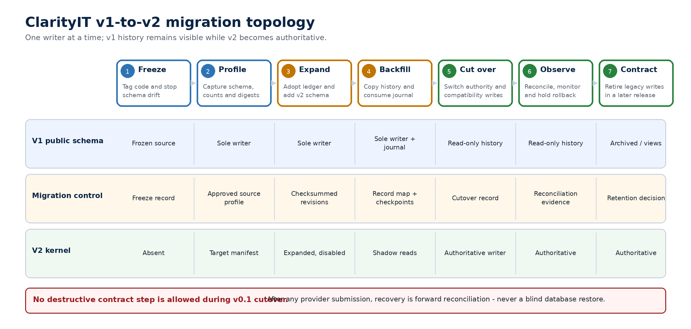

# ClarityIT v2 — v1-to-v2 Compatibility and Migration

*Preserve history, replace execution semantics, and move authority without inventing truth*

**Document type:** Engineering Specification

**Product:** ClarityIT v2

**Version:** 0.1

**Status:** Draft normative migration contract

**Date:** 30 July 2026

**Source code baseline:** Octo-Lex/ClarityIT main at b9d1587

**Source schema generation:** Migrations 001-040; 64 nominal unique table definitions

**Target authority:** ClarityIT v2 Authoritative Execution Kernel v0.1

> **Compatibility definition** Compatibility preserves identity, history, access, and supported workflows while allowing v2 to correct v1 semantics. It does not require ClarityIT v2 to continue unsafe behavior, treat legacy success as verified, or replay an inconsistent migration chain.

## Normative decision snapshot

- Build v2 on the v1 platform. Preserve stable identifiers and user-visible history; replace execution truth semantics behind explicit compatibility boundaries.

- Freeze the repository baseline at the exact commit and adopt only an approved live-schema profile. Source code or migration filenames alone are not evidence of a production database shape.

- Archive migrations 001-040 as historical provenance. A fresh v2 installation MUST use a reconciled baseline followed by immutable checksummed migrations; it MUST NOT replay the broken legacy chain.

- Introduce a durable migration ledger before any v2 schema change. Every revision, checksum, source commit, run, checkpoint, and cutover decision is recorded.

- Use expand -\> backfill -\> reconcile -\> cut over -\> observe -\> contract. There is one authoritative writer for each object family at every stage; bidirectional dual-write is prohibited.

- Legacy approvals, effect results, remediation results, provider task IDs, and operator outcome text remain source-attributed evidence or claims. Migration creates no passed Verification or Accepted outcome from v1 data.

- Retain v1 read compatibility. After cutover, only the supported virtual-machine start path may translate into the v2 kernel; synthetic tool execution and unsupported consequential mutations fail explicitly.

- Before external submission, rollback may return to the frozen v1 application. After a provider call may have occurred, recovery is reconciliation and forward correction - never blind database restoration.

## 1. Authority, purpose, and scope

This specification is normative for database revisions, compatibility APIs, historical imports, event coexistence, worker sequencing, release gates, cutover, and recovery from ClarityIT v1 to ClarityIT v2. The Product Definition v0.1 governs product scope. The Authoritative Execution Kernel Specification v0.1 governs execution truth. This document governs how existing implementation and data enter that model without loss or semantic inflation.

> **Primary objective** Move authority from the current v1 execution paths to the v2 kernel while keeping the platform usable, preserving every material historical record, and making uncertainty more explicit rather than less.

### 1.1 In scope

- Repository, migration, schema, API, event, worker, and CI baseline at the named source commit.

- Source-profile capture and approval for each database to be migrated.

- Disposition of every v1 table and detailed mapping of execution-relevant fields.

- New v2 tables, ownership, constraints, indexes, migration-control records, and compatibility references.

- Historical truth classification, including legacy_unverified and outcome_unknown.

- Fresh installation, upgrade, backfill, reconciliation, cutover, rollback, recovery, and contract sequencing.

- Compatibility behavior for existing UI and API clients during coexistence.

- Fixtures, tests, observability, ownership, evidence, and release gates.

### 1.2 Out of scope

- The complete generic compute-adapter protocol and Proxmox request/response profile.

- Production Site Runtime protocol, host sensors, additional providers, or additional consequential capabilities.

- A general rename of every team, API, and table to workspace in the first v2 slice.

- Destructive cleanup of legacy tables during the v0.1 migration window.

- Reconstructing missing provider completion or health evidence after the fact.

- Changing the Product Definition or kernel state machines through migration convenience.

### 1.3 Normative terms

| **Term**                | **Meaning**                                                                                                                           |
|-------------------------|---------------------------------------------------------------------------------------------------------------------------------------|
| **Source profile**      | Approved description and fingerprint of one actual v1 database shape and its data preconditions.                                      |
| **Legacy chain**        | Repository SQL migrations 001-040 and their historical application behavior.                                                          |
| **Reconciled baseline** | One clean-install schema representing the approved v2 starting point; generated after source-shape decisions.                         |
| **Compatibility alias** | Existing route or view that preserves a supported v1 contract while translating to or reading from v2.                                |
| **Cutover commit**      | Recorded point after which v2 owns writes for the named object families.                                                              |
| **Contract**            | Later removal of obsolete legacy write paths or physical structures after retention and rollback windows.                             |
| **Truth inflation**     | Migration that upgrades a proposal, claim, receipt, or operator annotation into Verification or acceptance without required evidence. |

## 2. Frozen v1 baseline

The compatibility target is grounded in the current repository rather than its older README summary. The baseline below was inspected on 30 July 2026. The repository is clean and main matches origin/main at the listed commit.

| **Dimension**              | **Observed baseline**                                                          | **Migration significance**                                 |
|----------------------------|--------------------------------------------------------------------------------|------------------------------------------------------------|
| **Repository**             | Octo-Lex/ClarityIT                                                             | Canonical code source                                      |
| **Branch / commit**        | main / b9d15877583e84c45ab5478dfaa6087966926fc5                                | Frozen logical v1 source baseline                          |
| **Commit date / subject**  | 19 June 2026 / fix(board): include version in BoardView so drag-and-drop works | Traceability                                               |
| **Database target**        | PostgreSQL 16                                                                  | docker-compose and CI                                      |
| **Migration inventory**    | 001-040; 40 SQL files; 64 nominal unique table names                           | Actual repository inventory                                |
| **Application**            | Go 1.25 modular API and workers                                                | Backend foundation retained                                |
| **Web**                    | React 19.1, TypeScript 5.8, Vite 8                                             | Experience foundation retained                             |
| **Transport / data**       | NATS JetStream, Redis fan-out, MinIO, PostgreSQL                               | Redis is v1 compatibility only unless separately justified |
| **Migration execution**    | Sorted psql file loop; no durable migration ledger or checksum registry        | Must be replaced before v2 DDL                             |
| **CI**                     | Frontend and worker blocking; backend continue-on-error                        | Cannot satisfy v2 release gate                             |
| **Open schema issue**      | \#1: clean database migration failures                                         | Blocking source-baseline defect                            |
| **Operational code delta** | PR \#2 open; head cad4230; reported deployed out-of-band                       | Must be reconciled before freeze tag                       |

### 2.1 Known baseline defects and discrepancies

| **ID**     | **Finding**                                                                                                     | **Risk** | **Required disposition**                                                           |
|------------|-----------------------------------------------------------------------------------------------------------------|----------|------------------------------------------------------------------------------------|
| **V1-B01** | Migration 016 leaves four \*.edit permissions while asserting none remain.                                      | Low      | Choose canonical permission names; reconcile data and role grants.                 |
| **V1-B02** | Migration 018 recreates agent tables already created by 005 with conflicting columns and without IF NOT EXISTS. | High     | Approve one live schema profile; never infer it from migration order.              |
| **V1-B03** | Migration 029 grants to clarityit_app although the role is not created by the chain.                            | Medium   | Make role/privilege ownership explicit in the reconciled baseline.                 |
| **V1-B04** | Makefile migration loop has no ON_ERROR_STOP, ledger, checksum, lock, or transaction policy.                    | High     | Introduce a real migration runner and adoption gate.                               |
| **V1-B05** | README still describes 18-19 migrations and 37 tables.                                                          | Medium   | Documentation counts cannot be used for upgrade decisions.                         |
| **V1-B06** | Backend CI is intentionally non-blocking while migration defects remain.                                        | High     | Migration matrix must become blocking before v2 work merges.                       |
| **V1-B07** | PR \#2 is open but its change is reported live in production.                                                   | High     | Reconcile deployed bytes, main, and the freeze tag; no untracked production delta. |
| **V1-B08** | V1 statuses conflate policy allowance, provider acceptance, completion, verification, and outcome.              | Critical | Historical classification must preserve the weaker meaning.                        |

> **Baseline adoption gate** No executable v2 upgrade SQL may be approved until production and every supported source environment has a schema-only capture, normalized schema fingerprint, row-count manifest, key data-quality checks, extension and role inventory, and tested backup restore. This specification defines the contract; it does not invent the unknown live schema.

### 2.2 Supported source profiles

| **Profile**                             | **Definition**                                                               | **Treatment**                                         |
|-----------------------------------------|------------------------------------------------------------------------------|-------------------------------------------------------|
| **P0 - repository logical**             | Code and SQL at b9d1587                                                      | Design comparison only; not automatically migratable. |
| **P1 - approved production**            | Schema and data manifest captured from the authoritative running environment | Mandatory upgrade source after owner approval.        |
| **P2 - representative restored backup** | Recent production backup restored into isolated PostgreSQL 16                | Mandatory rehearsal and rollback evidence.            |
| **P3 - clean legacy fixture**           | Sanitized deterministic fixture matching P1 constraints                      | CI upgrade matrix.                                    |
| **Unknown / drifted**                   | Fingerprint not on the approved allowlist                                    | Fail closed; reconcile manually before migration.     |

## 3. Compatibility and migration invariants

| **ID**    | **Invariant**                                                                                                                                                                    |
|-----------|----------------------------------------------------------------------------------------------------------------------------------------------------------------------------------|
| **CM-01** | Every migrated row is attributable to an exact source table, primary key, source profile, and migration run.                                                                     |
| **CM-02** | Stable team, object, work-item, incident, asset, artifact, and knowledge identifiers are preserved when the target key type and meaning are unchanged.                           |
| **CM-03** | A new v2 semantic object receives a new identifier; a legacy ID is never reused for a different aggregate type.                                                                  |
| **CM-04** | Migration creates no passed Verification and no Accepted outcome from v1 records.                                                                                                |
| **CM-05** | A v1 succeeded effect without provider completion and independent verification becomes legacy_unverified, not provider_completed or verified.                                    |
| **CM-06** | Provider submission ambiguity becomes outcome_unknown and blocks automatic resubmission.                                                                                         |
| **CM-07** | There is exactly one authoritative writer per object family at every migration stage.                                                                                            |
| **CM-08** | Authoritative state, audit transition, and outbox event commit in one PostgreSQL transaction after cutover.                                                                      |
| **CM-09** | Backfills and journal replay are restartable, idempotent, bounded, and checkpointed.                                                                                             |
| **CM-10** | Every compatibility write either translates into a supported v2 command or fails explicitly; it never falls through to a legacy execution path.                                  |
| **CM-11** | Legacy reads preserve original fields and add truth classification without rewriting source history.                                                                             |
| **CM-12** | No column or table required for rollback, audit, evidence, or unresolved history is dropped during the v0.1 release.                                                             |
| **CM-13** | Secrets, password hashes, token material, MFA material, API-key hashes, and credential references are never copied into migration reports, events, prompts, or evidence exports. |
| **CM-14** | Rollback cannot erase or pretend to reverse an external effect. Once submission may have occurred, recovery uses reconciliation and successor operations.                        |
| **CM-15** | Cutover is prohibited until blocking CI, fresh install, representative upgrade, reconciliation, restart, and compatibility contract tests all pass.                              |

> **Execution truth invariant** Provider, worker and agent outputs remain source-attributed claims after persistence. Only independent verification can establish a verified result, and only a separate outcome decision can accept it.

## 4. Migration architecture and control records

*Figure 1. ClarityIT v1-to-v2 migration topology and write ownership.*

The migration is an expand-and-contract program with a recorded cutover point. V1 remains the sole writer while v2 structures are expanded and backfilled. Shadow reads compare v1 and v2 without serving v2 results. At cutover, supported compatibility endpoints invoke the v2 application service; the public v1 execution tables become historical projections.

### 4.1 Migration-control schema

| **Table**                             | **Minimum fields**                                                                                       | **Required constraint**                                       |
|---------------------------------------|----------------------------------------------------------------------------------------------------------|---------------------------------------------------------------|
| **platform.schema_revisions**         | version, name, checksum, source_commit, applied_at, applied_by, execution_ms, success                    | Unique version and checksum; immutable after success.         |
| **platform.migration_runs**           | run_id, source_profile_id, target_version, state, started_at, completed_at, release_id, evidence_ref     | One active run per database; explicit state transitions.      |
| **platform.source_profiles**          | profile_id, schema_fingerprint, PostgreSQL version, extensions, roles digest, source_commit, approved_by | Fingerprint allowlist; approval required.                     |
| **platform.migration_record_map**     | run_id, source_table, source_pk, target_type, target_id, classification, source_digest                   | Unique source row mapping; supports restart and traceability. |
| **platform.migration_checkpoints**    | run_id, task, partition, high_watermark, rows_read, rows_written, digest, completed_at                   | Unique run/task/partition checkpoint.                         |
| **platform.migration_change_journal** | sequence, table_name, operation, source_pk, row_digest, occurred_at, txid, processed_at                  | Append-only delta capture; delete tombstones retained.        |
| **platform.cutover_records**          | run_id, cutover_version, old_writers_disabled_at, new_writers_enabled_at, decided_by, decision           | Exactly one committed cutover per run.                        |
| **platform.reconciliation_results**   | run_id, check_id, scope, expected, actual, result, evidence_ref                                          | Append-only release evidence.                                 |

### 4.2 Migration-run state machine

> planned -\> profiled -\> preflighted -\> expanding -\> backfilling  
> -\> reconciling -\> cutover_ready -\> cutover_committed  
> -\> observing -\> completed  
>   
> Exceptional: blocked \| paused \| precommit_rolled_back \| forward_recovery_required

| **State**              | **Allowed work**                                    | **Exit condition**                        |
|------------------------|-----------------------------------------------------|-------------------------------------------|
| **planned / profiled** | No DDL or data write                                | Source identity and fingerprint only.     |
| **preflighted**        | Backup restore and invariants pass                  | Run may acquire migration lock.           |
| **expanding**          | Additive DDL only                                   | V1 behavior unchanged; feature flags off. |
| **backfilling**        | Idempotent target writes and journal capture        | V1 remains sole business writer.          |
| **reconciling**        | Counts, mappings, digests, orphans, classifications | No cutover with unexplained mismatch.     |
| **cutover_ready**      | All gates pass and change journal is caught up      | Human go/no-go required.                  |
| **cutover_committed**  | V1 writers disabled before v2 writers enabled       | Cutover record is authoritative.          |
| **observing**          | Heightened monitoring and rollback hold             | No contract DDL.                          |
| **completed**          | Observation window and final evidence accepted      | Contract remains separate release.        |

### 4.3 Source schema fingerprint

The profile fingerprint is SHA-256 over a normalized schema manifest: PostgreSQL version, required extensions, schemas, relations, columns and types, defaults, nullability, primary/unique/foreign/check constraints, indexes, triggers, functions used by migrations, and relevant roles/grants. Ownership, volatile statistics, object OIDs, physical file locations, and dump timestamps are excluded. The complete manifest remains an evidence artifact; the digest is stored in platform.source_profiles.

> **Fail-closed profile rule** A database whose normalized fingerprint is not an approved profile is not automatically upgraded. Operators may create and approve a new profile only after comparing the drift, proving data compatibility, and rehearsing the upgrade on a restored copy.

## 5. v1-to-v2 object mapping

| **V1 family**                                | **V2 concept**                                               | **Binding rule**                                                                                           |
|----------------------------------------------|--------------------------------------------------------------|------------------------------------------------------------------------------------------------------------|
| **teams**                                    | Workspace identity                                           | Preserve teams.id as workspace_id in v0.1; retain IAM and membership tables.                               |
| **objects**                                  | Shared identity spine                                        | Preserve objects.id; cases and resources are typed extensions, not replacement identities.                 |
| **work_items**                               | Work Item                                                    | Retain existing extension and fields; add objective/success semantics through v2 extension where required. |
| **incidents**                                | Case subtype                                                 | Preserve object_id; import operational context without manufacturing Accepted outcome.                     |
| **alerts**                                   | Signal / source record                                       | Retain; may open or link to a Case; alert status is not resource truth.                                    |
| **assets**                                   | Resource + ProviderBinding                                   | Preserve object_id as Resource ID; parse provider identity into a versioned binding.                       |
| **context graph**                            | Derived projection                                           | Preserve review history; rebuild nodes/edges/bundles from authoritative records where possible.            |
| **agent identities / runs / intentions**     | Reasoning principals, runs, findings and proposal provenance | Retain; none becomes authority or execution proof.                                                         |
| **agent_tool_grants**                        | Legacy agent permission history                              | Read-only after cutover; never convert into AuthorityGrant.                                                |
| **approval policies / requests / decisions** | Legacy policy and decision evidence                          | Retain and reference; never authorize a v2 packet.                                                         |
| **remediation proposals / steps**            | OperationPacket draft candidates / planned operations        | Import intent; approved or succeeded status does not survive as v2 authority or success.                   |
| **asset_actions**                            | ExecutionAttempt and ProviderReceipt candidates              | Import only the evidence actually present; UPID means submitted, not completed.                            |
| **agent_effect_results**                     | ResultClaim                                                  | Classify succeeded as legacy_unverified unless independent proof exists elsewhere.                         |
| **recommendation_evidence**                  | Claim/evidence artifact                                      | Retain provenance, staleness, and confidence; editable JSON is not Verification.                           |
| **action_outcomes**                          | Legacy operator assessment                                   | Retain text and source; do not create passed Verification or Accepted outcome.                             |
| **audit_logs**                               | Historical audit                                             | Retain immutable; v2 audit uses stronger principal, correlation, causation and version fields.             |
| **outbox_events**                            | Legacy transport history                                     | Drain or dead-letter deliberately; never replay as v2 authoritative events.                                |
| **idempotency_keys**                         | Legacy HTTP deduplication                                    | Retain to expiry; v2 execution idempotency is stored with attempts and new message inbox.                  |
| **storage / artifacts / knowledge**          | Durable product content                                      | Retain; preserve object IDs, hashes, versions, provenance and access scope.                                |

### 5.1 Identifier and timestamp rules

- teams.id remains the workspace identifier for v0.1. API language may say workspace; physical renaming is deferred.

- objects.id remains the identity of a Work Item, Case, or Resource when the external subject is the same.

- New packets, decisions, grants, attempts, receipts, claims, observations, verifications, outcomes, and manifests receive new UUIDv7 identifiers.

- platform.migration_record_map stores every source-to-target relationship; source IDs also remain in provenance metadata.

- Source created_at and updated_at are preserved as source timestamps. Target recorded_at is the migration acceptance time.

- A missing actor is recorded as legacy:unknown with the source record; it is never silently rewritten to system or the migrator.

- Soft-deleted rows retain deletion time and are excluded from active projections but remain reconcilable.

### 5.2 Resource and Proxmox binding map

| **V1 field**           | **V2 field**                        | **Rule**                                                                                                  |
|------------------------|-------------------------------------|-----------------------------------------------------------------------------------------------------------|
| **assets.object_id**   | kernel.resources.object_id          | Direct; same UUID and workspace.                                                                          |
| **assets.asset_type**  | resources.resource_type             | vm/qemu -\> compute.virtual_machine; lxc/container remains legacy or a later compute.container type.      |
| **assets.provider**    | provider_bindings.adapter_id        | proxmox -\> proxmox-ve; unknown provider requires profile mapping.                                        |
| **assets.external_id** | provider_bindings.external_identity | pve:{node}:{vmid} -\> {node, vmid}; cluster must come from approved connector configuration; never guess. |
| **assets.hostname**    | resource display metadata           | Retain as a mutable label, never execution identity.                                                      |
| **assets.service_id**  | resource relationship               | Preserve as unresolved relationship if target does not exist.                                             |
| **objects.version**    | resources.aggregate_version seed    | Use only after source-profile checks; binding version is separately monotonic.                            |
| **objects.metadata**   | resource metadata                   | Copy allowed fields; secret scanning and schema allowlist required.                                       |

> **Cluster identity** V1 external_id contains node and VMID but not a stable cluster identifier. The migration MUST obtain cluster identity from the approved Proxmox connector profile and record the binding version. Node + VMID alone is insufficient across multiple clusters.

## 6. Historical truth classification

Historical import is evidence preservation, not retroactive execution. Each mapped record receives a migration classification in platform.migration_record_map and, where applicable, a ResultClaim source classification. These labels describe the strength of evidence available from v1; they do not add states to the kernel's live state machines.

| **Classification**              | **Meaning**                                                                                        | **V2 consequence**                                      |
|---------------------------------|----------------------------------------------------------------------------------------------------|---------------------------------------------------------|
| **legacy_context**              | Identity, narrative, plan, alert, comment, or configuration context only.                          | No execution state.                                     |
| **legacy_proposed**             | A v1 intention, remediation proposal, or pending action.                                           | May seed a draft; requires a new packet to execute.     |
| **legacy_decision_evidence**    | A v1 approval or rejection bound to legacy action_type/JSON target.                                | Visible evidence; cannot issue v2 grant.                |
| **legacy_denied**               | Policy or approval explicitly denied or blocked the request.                                       | Preserve denial and reason.                             |
| **legacy_submitted_unverified** | Provider operation identifier exists, but terminal provider completion is not recorded.            | ResultClaim only; never provider_completed.             |
| **legacy_failed_claim**         | V1 recorded an execution/provider failure.                                                         | Preserve source and raw reason; not independent proof.  |
| **legacy_unverified**           | V1 recorded succeeded/completed without required provider completion and independent verification. | Historical claim; no Verification row.                  |
| **legacy_outcome_unknown**      | Operation may have been submitted or was executing when evidence stopped.                          | Requires reconciliation; no automatic retry.            |
| **legacy_operator_assessment**  | Operator supplied actual result, feedback, or success label.                                       | Annotation/evidence; not Verification or Accepted.      |
| **derived_rebuildable**         | Projection, context edge, bundle, search index, cache, or transport state.                         | Rebuild or retain separately; not authoritative import. |

### 6.1 Deterministic classification rules

| **Source condition**                              | **Classification**              | **Reason**                                                                     |
|---------------------------------------------------|---------------------------------|--------------------------------------------------------------------------------|
| **agent_effect_results.status=succeeded**         | legacy_unverified               | Tool Gateway currently writes success without invoking a tool.                 |
| **agent_effect_results denied/blocked/cancelled** | legacy_denied or legacy_context | Preserve decision and sanitized reason.                                        |
| **remediation_steps.status=succeeded**            | legacy_unverified               | Policy allowed the synthetic step; no tool dispatch is proven.                 |
| **remediation_proposals completed**               | legacy_unverified               | Aggregate completion inherits synthetic step semantics.                        |
| **asset_actions succeeded + proxmox_task_id**     | legacy_submitted_unverified     | UPID proves provider acceptance identifier, not terminal task success.         |
| **asset_actions executing**                       | legacy_outcome_unknown          | Possible provider operation; reconcile before any new mutation.                |
| **asset_actions failed**                          | legacy_failed_claim             | Preserve error and audit; do not infer target state.                           |
| **approval_requests approved/executed**           | legacy_decision_evidence        | Legacy subject binding is insufficient for v2 authority.                       |
| **action_outcomes any outcome_status**            | legacy_operator_assessment      | Preserve expected/actual/feedback; create no Verification or Accepted outcome. |
| **recommendation_evidence**                       | legacy_context                  | Preserve confidence/staleness and source; no factual promotion.                |
| **outbox events sent/failed/dead_letter**         | derived_rebuildable             | Archive transport history; do not convert into domain state.                   |

> **Zero-row truth gate** The historical backfill MUST create zero passed kernel.verifications and zero accepted kernel.outcome_decisions. Any non-zero result blocks cutover and is treated as truth inflation.

## 7. Target v2 schema contract

V1 tables remain in public during coexistence. New execution-authority records are created in kernel and migration-control records in platform. New code uses fully qualified names. This isolates canonical v2 semantics, prevents collisions with v1 approval and outbox tables, and permits delayed contract cleanup.

### 7.1 Core and resource extensions

| **Table**                     | **Minimum columns**                                                                                                                                          | **Constraints and indexes**                                                                                  |
|-------------------------------|--------------------------------------------------------------------------------------------------------------------------------------------------------------|--------------------------------------------------------------------------------------------------------------|
| **kernel.cases**              | object_id PK/FK objects; workspace_id FK teams; objective; success_criteria; accountable_owner_id; projection_state; aggregate_version; legacy_closure_basis | Unique object_id; workspace/object consistency; version \> 0 Indexes: workspace_id,state; owner; updated_at  |
| **kernel.resources**          | object_id PK/FK objects; workspace_id; resource_type; environment; status; aggregate_version; metadata                                                       | Stable ID; active type required; version \> 0 Indexes: workspace_id,type,status                              |
| **kernel.provider_bindings**  | id; workspace_id; resource_id; adapter_id/version; route; external_identity JSONB; binding_version; valid_from/to; source                                    | Unique active resource+adapter+route; canonical identity digest Indexes: resource_id active; identity_digest |
| **kernel.observations**       | id; workspace_id; resource_id; source; observed_at; received_at; fieldset; state; external_revision; fresh_until; fingerprint; artifact_refs                 | Append-only; source and fingerprint required Indexes: resource_id,observed_at desc; fingerprint              |
| **kernel.legacy_record_refs** | id; run_id; source_table; source_pk; target_type/id; classification; source_digest                                                                           | Unique run+source table+PK Indexes: target_type,target_id; classification                                    |

### 7.2 Authority and execution tables

| **Table**                        | **Purpose / minimum content**                                                                                                       | **Constraints and indexes**                                                                                               |
|----------------------------------|-------------------------------------------------------------------------------------------------------------------------------------|---------------------------------------------------------------------------------------------------------------------------|
| **kernel.operation_packets**     | Immutable canonical packet, digest, signature, supersedes, validity.                                                                | Unique workspace+digest; no UPDATE after proposed. Indexes: case_id; resource_id; state; expires_at                       |
| **kernel.policy_decisions**      | Packet digest, context digest, policy revision, decision, requirements, reason codes.                                               | Append-only; exact packet and revision. Indexes: packet_id; decision; recorded_at                                         |
| **kernel.approval_decisions**    | Packet digest, baseline fingerprint, policy revision, principal, approve/reject, MFA, reason.                                       | Unique subject+required principal decision; append-only. Indexes: packet_id; principal; decision                          |
| **kernel.authority_grants**      | Packet/resource/capability/case, workload and route identities, policy revision, validity, max uses, reservation.                   | Scoped FK set; state check; use count \<= max. Indexes: state,expires_at; packet_digest; subject identity                 |
| **kernel.execution_attempts**    | Packet, grant, target, capability, attempt lineage, idempotency, state, poll checkpoint, provider operation reference.              | Unique workspace+idempotency; legal transition trigger/service. Indexes: state,next_poll_at; resource; provider operation |
| **kernel.provider_receipts**     | Attempt, route/adapter version, receipt kind, source time, accepted time, provider operation ID, raw code, payload/artifact digest. | Append-only; sequence unique per attempt/source. Indexes: attempt_id,sequence; provider operation                         |
| **kernel.result_claims**         | Attempt or legacy ref, claim type/status, source refs, normalized payload, classification.                                          | No claim may set Verification or outcome. Indexes: attempt_id; classification; recorded_at                                |
| **kernel.verification_specs**    | Versioned verifier type, sources, predicates, freshness, thresholds, timeouts, secret refs.                                         | Immutable version; unique spec identity+version. Indexes: type; active version                                            |
| **kernel.verifications**         | Packet/attempt/spec, state, input digests, result, reason codes, started/completed.                                                 | Passed requires exact spec and sealed fresh inputs. Indexes: attempt_id; result; completed_at                             |
| **kernel.verification_evidence** | Verification, source, observed time, payload/artifact digest, probe outcome.                                                        | Append-only; unique evidence digest within verification. Indexes: verification_id,observed_at                             |
| **kernel.outcome_decisions**     | Case/packet/attempt/verification, principal, decision, rationale, successor.                                                        | Accepted requires passed verification in first release. Indexes: case_id; decision; recorded_at                           |
| **kernel.evidence_manifests**    | Lineage references, schema, artifact digests, redaction policy, canonical digest, signature.                                        | Append-only; unique lineage+manifest version. Indexes: case_id; digest; sealed_at                                         |

### 7.3 Messaging and compatibility tables

| **Table**                             | **Purpose**                                                    | **Constraint**                                                           |
|---------------------------------------|----------------------------------------------------------------|--------------------------------------------------------------------------|
| **kernel.outbox_events**              | Authoritative v2 envelope committed with aggregate transition. | Unique message_id; aggregate version; payload digest; no secret payload. |
| **kernel.inbox_messages**             | Consumer deduplication and recorded outcome.                   | PK consumer+message_id; write before/with side effect.                   |
| **compat.status_projections**         | Optional cached mapping from v2 state to legacy read shape.    | Derived and rebuildable; never a writer.                                 |
| **compat.api_idempotency**            | Maps legacy HTTP idempotency namespace to v2 command/attempt.  | Unique workspace+method+path+key+fingerprint.                            |
| **platform.migration_change_journal** | Temporary delta capture while v1 is writer.                    | Monotonic sequence; append-only; delete tombstone.                       |

### 7.4 DDL rules

- All v2 DDL is forward-only, checksummed, and executed under a database advisory lock.

- DDL uses explicit transactions where PostgreSQL permits; non-transactional index creation is isolated and resumable.

- Large-table indexes are created concurrently after backfill where required; constraints are added NOT VALID then validated deliberately.

- No migration file is edited after it succeeds in any shared environment. Corrections are new revisions.

- Application startup checks an allowed schema-version range and refuses writes outside it.

- Contract DDL is a separate release with backup, retention, legal-hold, and compatibility approval.

## 8. Detailed critical field mapping

The following maps every execution-relevant v1 field. Retained IAM, artifact, document, storage, and knowledge tables keep their existing columns unless a later specification changes them; their table-level disposition is in Appendix A.

### 8.1 Agent runtime

| **V1 table**             | **Fields**                                                                                                                                        | **Target rule**                                                                                                                        |
|--------------------------|---------------------------------------------------------------------------------------------------------------------------------------------------|----------------------------------------------------------------------------------------------------------------------------------------|
| **agent_identities**     | id, team_id, name, status, created_by, created_at, updated_at, deleted_at                                                                         | Retain directly as reasoning-principal profile and provenance.                                                                         |
| **agent_identities**     | agent_type, description, metadata                                                                                                                 | Retain descriptive metadata; schema allowlist and secret scan.                                                                         |
| **agent_identities**     | max_autonomy / max_autonomy_level                                                                                                                 | Legacy policy metadata only; does not create v2 authority.                                                                             |
| **agent_tool_grants**    | id, agent_id, team_id, tool_name, max_autonomy_level, requires_approval, requires_mfa, expires_at, created_by, created_at, revoked_at, revoked_by | Retain read-only as legacy permission history; no AuthorityGrant row.                                                                  |
| **agent_runs**           | all fields                                                                                                                                        | Retain reasoning-run provenance; status remains a reasoning status.                                                                    |
| **agent_intentions**     | id, run/team, type, target, tool, confidence, risk, autonomy, payload, reasoning, evidence, status, approval fields, timestamps                   | Retain proposal/finding provenance. Supported start intentions may seed a new draft packet only after explicit conversion.             |
| **agent_effect_results** | id, intention_id, team_id, tool_name, status, approval_id, audit_event_id, result/result_payload, created_at                                      | Create a source-linked ResultClaim using deterministic legacy classification; never create provider receipt, Verification, or outcome. |
| **tool_registry**        | all fields                                                                                                                                        | Retain as legacy tool catalog. It may inform capability discovery but is not the v2 adapter/capability registry.                       |

### 8.2 Approval and remediation

| **V1 table**              | **Fields**                                                                                                        | **Target rule**                                                                                                                            |
|---------------------------|-------------------------------------------------------------------------------------------------------------------|--------------------------------------------------------------------------------------------------------------------------------------------|
| **approval_policies**     | all fields                                                                                                        | Retain policy configuration as legacy context; v2 PolicyDecision is a per-packet evaluation, not a copied policy row.                      |
| **approval_requests**     | id, team_id, action_type, action_target, risk_level, description, requested_by, policy_id, expires_at, timestamps | Retain as legacy decision subject evidence with source digest.                                                                             |
| **approval_requests**     | status, executed_at, failure_reason                                                                               | Preserve verbatim; do not translate approved/executed into grant, completion, or acceptance.                                               |
| **approval_decisions**    | id, approval_id, decided_by, decision, reason, mfa_verified, created_at                                           | Retain legacy decision evidence; no v2 ApprovalDecision because packet digest, baseline, policy revision, and resource version are absent. |
| **remediation_proposals** | id, team_id, title, description, risk_level, source, incident_id, agent_run_id, created_by, timestamps            | Retain and map as a packet-draft candidate/provenance.                                                                                     |
| **remediation_proposals** | status, approved_by, approval_id, idempotency_key                                                                 | Preserve as legacy state only; no authority or executable packet.                                                                          |
| **remediation_steps**     | id, proposal_id, order, tool_name, risk, parameters, continue_on_failure, timestamps                              | Retain planned operation; typed supported step may be explicitly converted to a new packet.                                                |
| **remediation_steps**     | approval_id, effect_result_id, status, error_message                                                              | Classify evidence; succeeded becomes legacy_unverified.                                                                                    |

### 8.3 Asset action and outcome

| **V1 table**                 | **Fields**                                                                                                           | **Target rule**                                                                                                         |
|------------------------------|----------------------------------------------------------------------------------------------------------------------|-------------------------------------------------------------------------------------------------------------------------|
| **asset_actions**            | id, team_id, asset_id, requested_by, created_at, updated_at                                                          | Preserve source identity and link to Resource/legacy record.                                                            |
| **asset_actions**            | action_type                                                                                                          | proxmox.start may map to compute.virtual_machine.start; other types remain unsupported legacy history in first release. |
| **asset_actions**            | approval_id                                                                                                          | Legacy decision reference only; cannot authorize v2.                                                                    |
| **asset_actions**            | status                                                                                                               | Classify deterministically; never direct-map succeeded to provider_completed.                                           |
| **asset_actions**            | proxmox_task_id                                                                                                      | Provider operation reference / submitted claim only. Preserve opaque UPID.                                              |
| **asset_actions**            | result, error_message                                                                                                | Preserve source claim and sanitized raw code; no verification.                                                          |
| **asset_actions**            | snapshot_name                                                                                                        | Legacy parameter retained; snapshot capability is not executable in first release.                                      |
| **asset_actions**            | executed_at, completed_at                                                                                            | Preserve source timestamps; names do not prove actual provider completion.                                              |
| **action_outcomes**          | id, team_id, source FKs, expected_result, actual_result, feedback, outcome_status, recommendation, actor, timestamps | Preserve as legacy_operator_assessment evidence. Create no kernel Verification and no Accepted outcome.                 |
| **proxmox_mutation_windows** | all fields                                                                                                           | Retain as legacy governance context. V2 packet/grant validity and policy replace its authorization role.                |

### 8.4 Audit, messaging, and evidence

| **V1 table**                | **Fields**                                                                    | **Target rule**                                                                                         |
|-----------------------------|-------------------------------------------------------------------------------|---------------------------------------------------------------------------------------------------------|
| **audit_logs**              | all fields                                                                    | Retain immutable. Add source profile/run reference only in mapping table; do not rewrite events.        |
| **outbox_events**           | all fields                                                                    | Drain pending work, classify dead letters, archive; do not publish legacy rows as v2 events.            |
| **idempotency_keys**        | all fields                                                                    | Keep for v1 replay window and TTL; do not reuse as execution idempotency without compatibility mapping. |
| **recommendation_evidence** | all fields                                                                    | Retain as source-attributed claim artifact with original confidence and staleness.                      |
| **storage_objects**         | id, team, bucket/key, type, size, sha256, encryption, retention, creator/time | Retain bytes reference and digest; verify object availability without downloading secrets into reports. |
| **object_storage_refs**     | all fields                                                                    | Retain object-to-storage relationship; map object identity directly.                                    |

## 9. API compatibility and coexistence

Current routes are largely unversioned under /api/teams/{teamId}. V2 introduces explicit /api/v2/workspaces/{workspaceId} contracts while retaining selected existing paths as compatibility aliases. An alias is an application adapter, not a second implementation of business logic.

| **API family**                                                | **Compatibility behavior**                                                     | **Semantic rule**                                                                            | **Disposition** |
|---------------------------------------------------------------|--------------------------------------------------------------------------------|----------------------------------------------------------------------------------------------|-----------------|
| **IAM, teams, members, sessions, MFA**                        | Retain current routes                                                          | teamId aliases workspaceId; existing permission checks remain.                               | Retain          |
| **Objects, links, comments, work items, incidents, projects** | Retain current routes; add v2 Case APIs                                        | Preserve object IDs and versions; v2 case extension is authoritative for governed lifecycle. | Retain/evolve   |
| **Agents, runs, intentions**                                  | Retain proposal/read routes                                                    | Reasoning outputs remain non-authoritative.                                                  | Retain          |
| **POST .../tool-gateway/execute**                             | Return 410 legacy_execution_removed after cutover                              | It cannot report synthetic success or bypass v2 broker.                                      | Retire write    |
| **Approvals read/list**                                       | Retain for legacy history                                                      | Expose legacy subject and classification.                                                    | Read-only       |
| **Legacy approve/reject**                                     | Allowed only for legacy non-v2 subjects before cutover; blocked for v2 packets | Never issues v2 AuthorityGrant.                                                              | Constrain       |
| **Proxmox status/sync and asset reads**                       | Retain                                                                         | Feeds Resource and ProviderBinding views.                                                    | Retain/evolve   |
| **Create Proxmox start action**                               | Compatibility alias to v2 Case/packet proposal                                 | Returns 202 and linked v2 identifiers; no succeeded response.                                | Translate       |
| **Execute Proxmox start action**                              | Compatibility alias to v2 broker command                                       | Requires valid v2 packet/decision/grant; uses same idempotency mapping.                      | Translate       |
| **Shutdown/stop/snapshot mutations**                          | Return 410 capability_not_available_in_v2                                      | First release supports start only; no fallback to v1 mutation.                               | Retire write    |
| **Remediation read/list**                                     | Retain legacy history                                                          | Show classifications and links to converted packets.                                         | Read-only       |
| **Remediation approve/execute**                               | Return 410 legacy_execution_removed after cutover                              | Conversion creates a new packet and authority cycle.                                         | Retire write    |
| **Legacy outcome create/update**                              | Return 409 verification_required for v2 lineages                               | May retain annotation only for unmigrated legacy history during deprecation.                 | Constrain       |
| **Artifacts, documents, knowledge**                           | Retain current routes                                                          | No execution authority semantics.                                                            | Retain          |
| **WebSocket**                                                 | Serve v1 and v2 envelope versions during window                                | Client declares accepted versions; v2 aggregate versions remain authoritative.               | Version         |

### 9.1 Compatibility response for translated start

> HTTP/1.1 202 Accepted  
> Deprecation: true  
> Link: \</api/v2/workspaces/{workspace}/cases/{case}\>; rel="successor-version"  
> X-ClarityIT-Compatibility: v1-proxmox-start-to-v2  
>   
> {  
> "legacy_asset_action_id": "...",  
> "case_id": "...",  
> "operation_packet_id": "...",  
> "execution_attempt_id": null,  
> "status": "decision_pending",  
> "status_uri": "/api/v2/workspaces/.../cases/..."  
> }

- A compatibility creation call proposes work; it does not create an execution attempt before authority.

- A successful provider submission later returns Submitted or running progress, never succeeded.

- The original client Idempotency-Key is preserved in compat.api_idempotency with method, path, workspace, and request fingerprint.

- A reused key with a different fingerprint returns 409 idempotency_conflict.

- Legacy response fields may be populated as projections, but truth_classification and v2_status are included and cannot contradict the kernel.

### 9.2 Compatibility window and retirement

| **Window**                  | **Behavior**                                                            | **Exit condition**                                                       |
|-----------------------------|-------------------------------------------------------------------------|--------------------------------------------------------------------------|
| **R0 - before cutover**     | V1 writes active; v2 shadow only                                        | No public behavior change.                                               |
| **R1 - cutover release**    | Supported start aliases translate; unsafe writes explicitly fail        | Minimum one supported release.                                           |
| **R2 - deprecation**        | Legacy read routes and fields retained with headers and successor links | Telemetry proves usage decline.                                          |
| **R3 - contract candidate** | Remove obsolete write code and optional routes                          | Separate approval after retention, customer notice, and rollback window. |

## 10. Events, workers, and derived state

- V1 event types clarity.v1.\* remain legacy transport history and are never reinterpreted as v2 domain events.

- V2 messages use the kernel envelope: message_id, schema_version, workspace, aggregate type/id/version, correlation, causation, actor, timestamps, payload digest, and typed payload.

- The v2 outbox is committed with the authoritative transition. Consumers deduplicate in kernel.inbox_messages before applying state.

- During shadow mode, v2 projection consumers may observe v1 changes only through the migration journal or explicit translation; they do not publish authoritative v2 completion events.

- Before cutover, pending v1 outbox work is drained, failed events classified, and poison messages terminated or moved to an explicit dead-letter record.

- PR \#2 or equivalent bounded retry, backoff, and poison-message handling MUST be merged and deployed from the frozen release artifact before migration.

- Context nodes, edges, bundles, search indexes, WebSocket projections, and caches are rebuildable and must not block cutover solely because their byte representation differs.

> **Operational delta gate** The freeze tag must contain every production-deployed code change. A file-copy deployment not represented by the release commit invalidates reproducibility and blocks source-profile approval.

## 11. Migration execution plan

| **Phase**                             | **Work**                                                                                                                                                               | **Gate**                                                                 |
|---------------------------------------|------------------------------------------------------------------------------------------------------------------------------------------------------------------------|--------------------------------------------------------------------------|
| **Phase 0 - freeze and inventory**    | Tag the exact v1 code; merge/reconcile operational deltas; announce schema freeze; capture source profiles, backups, extension/role inventory, row counts and digests. | Approved P1/P2/P3 profiles and restored backup.                          |
| **Phase 1 - baseline reconciliation** | Resolve 016, 018 and 029 decisions against live schema; produce reconciled clean-install baseline; archive legacy chain; introduce checksummed runner.                 | Fresh baseline installs cleanly; logical schema matches approved target. |
| **Phase 2 - expand**                  | Create platform, kernel, compat schemas and additive tables; install change journal; deploy v2-aware code with features off.                                           | No user-visible behavior change; v1 remains sole writer.                 |
| **Phase 3 - bulk backfill**           | Backfill identities, cases/resources/bindings, then historical claims and mappings in bounded partitions.                                                              | Every eligible source row mapped once; checkpoints complete.             |
| **Phase 4 - catch up and shadow**     | Consume journal deltas; rebuild derived state; compare v1 and v2 reads; run classification and truth gates.                                                            | Journal lag zero; reconciliation passes; cutover decision packet ready.  |
| **Phase 5 - cutover**                 | Enter bounded write freeze; drain v1 workers/outbox; final delta; disable legacy execution writers; enable v2 kernel and translated start aliases; record cutover.     | Only v2 owns consequential writes.                                       |
| **Phase 6 - observe**                 | Run heightened monitors, compatibility telemetry, evidence review, and no-destructive-change hold.                                                                     | Observation period accepted; no unresolved severity 1/2 issue.           |
| **Phase 7 - contract later**          | After a separate release decision, remove obsolete write code and optionally archive or replace legacy tables with views.                                              | Retention, legal hold, customer notice, and rollback windows satisfied.  |

### 11.1 Required migration order

1.  Acquire the advisory migration lock and validate source profile, application version, free space, backup age, restore proof, and replication health.

2.  Adopt platform.schema_revisions and record the source baseline without pretending legacy files were checksummed when they were not.

3.  Apply additive schemas and constraints; deploy code able to read both schemas while v2 feature flags remain disabled.

4.  Install change journal triggers on mutable source tables before taking the bulk-backfill high-watermark.

5.  Backfill shared identities and relationships before dependent records.

6.  Backfill resources and provider bindings; quarantine ambiguous external identities.

7.  Backfill legacy execution history using classification rules; create no passed Verification or Accepted outcome.

8.  Consume the change journal until zero lag, then run shadow-read and API contract comparisons.

9.  Perform the cutover freeze, drain, final journal replay, reconciliation, writer switch, and cutover record in the approved runbook order.

10. Hold destructive DDL until a later contract release.

### 11.2 Backfill mechanics

| **Area**             | **Rule**                                                                               | **Control**                                                    |
|----------------------|----------------------------------------------------------------------------------------|----------------------------------------------------------------|
| **Partition**        | Stable primary-key ranges or creation-time ranges with explicit tie-breaker PK.        | No OFFSET pagination.                                          |
| **Transaction size** | Bounded rows and time; default implementation target \<= 5,000 rows and \<= 5 seconds. | Tune from rehearsal; never one giant transaction.              |
| **Checkpoint**       | High watermark, counts, digest, last source PK, and target commit time.                | Persist after successful partition.                            |
| **Idempotency**      | UPSERT only through immutable source mapping and expected target digest.               | Mismatch blocks; do not overwrite silently.                    |
| **Concurrency**      | One worker per non-overlapping partition; database and replica lag budgets enforced.   | Pause automatically when thresholds exceed policy.             |
| **Deletes**          | Journal tombstone records source PK and deletion time.                                 | Apply to projection/active state; preserve historical mapping. |
| **Errors**           | Quarantine exact source row, reason code, sanitized sample and retry count.            | No skip-without-record.                                        |

## 12. Reconciliation and proof

Reconciliation is evaluated by object family and migration run. Counts alone are insufficient: every family needs identity coverage, referential integrity, classification, and deterministic content proof appropriate to its sensitivity.

| **Domain**           | **Proof**                                                                                   | **Gate**                                            |
|----------------------|---------------------------------------------------------------------------------------------|-----------------------------------------------------|
| **Schema**           | Expected revision/checksum set, object inventory, constraints, indexes, triggers and grants | Exact match to target manifest.                     |
| **Identity**         | Source eligible PKs vs migration_record_map                                                 | 100% mapped or explicitly quarantined and approved. |
| **Counts**           | Source eligible, target inserted, target active, deleted, quarantined                       | Balanced equation per family.                       |
| **Content**          | Chunked canonical row digests excluding volatile/secret fields                              | Digest match per completed partition.               |
| **Relationships**    | Orphan FKs, cross-workspace links, duplicate active bindings                                | Zero unexplained violation.                         |
| **Historical truth** | Classifications by source condition                                                         | Rules exact; zero truth inflation.                  |
| **Execution**        | UPID/action/effect mappings and ambiguous records                                           | Every ambiguous record visible; no auto-resubmit.   |
| **Messaging**        | V1 outbox pending/processing/failed/dead-letter and v2 inbox/outbox                         | Drained or accepted disposition; no lost message.   |
| **Derived state**    | Context/search/projection rebuild                                                           | Behavioral query parity within declared tolerance.  |
| **API**              | Golden v1 responses and v2 successor behavior                                               | Contract suite passes.                              |

### 12.1 Balance equations

> eligible_source = mapped_active + mapped_deleted + quarantined_approved  
> mapped_source = unique(source_profile, source_table, source_pk)  
> target_lineage = unique(target_type, target_id, source_mapping)  
> passed_verifications_from_legacy = 0  
> accepted_outcomes_from_legacy = 0  
> unexplained_orphans = 0  
> change_journal_unprocessed_at_cutover = 0

### 12.2 Sensitive-field proof

Password hashes, refresh and reset tokens, MFA secrets and recovery codes, WebAuthn material, integration-key hashes, encrypted payloads, and credential references are verified through internal count, nullability, key-presence, and HMAC/digest checks under restricted access. Their values are excluded from ordinary migration logs, screenshots, CI artifacts, prompts, and evidence exports.

## 13. Cutover runbook contract

1.  Record go/no-go participants, run ID, release artifact digests, source profile, target revisions, backup/PITR point, and expected duration.

2.  Block new consequential v1 writes and present a clear maintenance state; allow read access where safe.

3.  Stop reasoning, remediation, execution, context, and outbox workers in the approved order; retain observation-only sources if they cannot mutate.

4.  Drain or disposition the v1 outbox and ensure no handler can call a provider.

5.  Capture final source high-watermark and replay the migration change journal to zero lag.

6.  Run the blocking reconciliation set and review every quarantine and outcome_unknown record.

7.  Deploy or activate the v2-compatible API/worker release with kernel writes still disabled.

8.  Atomically disable legacy execution writers, commit platform.cutover_records, then enable v2 kernel writers and the supported start alias.

9.  Run read, authority, idempotency, no-provider-call smoke tests, then one controlled non-production end-to-end start test under the adapter profile.

10. Enter the observation window; publish status, evidence reference, and rollback/forward-recovery posture.

> **Writer-switch invariant** Legacy execution writers are disabled before v2 execution writers are enabled. If the switch cannot be proven, the system remains read-only for consequential actions.

### 13.1 Cutover smoke tests

| **Test**                     | **Pass condition**                                                                                               |
|------------------------------|------------------------------------------------------------------------------------------------------------------|
| **Identity**                 | Login, MFA, membership, permissions and workspace/team alias resolve correctly.                                  |
| **Read compatibility**       | Core v1 list/detail routes return preserved IDs and expected fields.                                             |
| **Unsafe legacy write**      | Tool Gateway execute, remediation execute and unsupported Proxmox effects fail explicitly without provider call. |
| **Supported start proposal** | Compatibility route returns 202 with Case and Operation Packet IDs, not succeeded.                               |
| **Authority**                | No execution attempt exists before valid v2 decision and grant.                                                  |
| **Idempotency**              | Duplicate request returns the same logical proposal/attempt; changed fingerprint conflicts.                      |
| **Persistence**              | State, audit and outbox commit atomically; event consumer deduplicates.                                          |
| **Truth**                    | Submitted, provider completed, observed, verified and accepted remain distinct.                                  |
| **Evidence**                 | Migration and first live lineage are reconstructable from manifests.                                             |

## 14. Rollback and recovery

Rollback depends on whether a consequential external submission may have occurred. Database state and provider state cannot be treated as one transactional resource.

| **Point**                                           | **Condition**                                            | **Required response**                                                                                          |
|-----------------------------------------------------|----------------------------------------------------------|----------------------------------------------------------------------------------------------------------------|
| **Before expand**                                   | No database change                                       | Abort run; correct profile or plan.                                                                            |
| **During additive DDL**                             | V1 remains writer; no provider behavior changed          | Disable v2 code/flags; leave additive structures or remove only if proven unused.                              |
| **During backfill/shadow**                          | V1 remains writer; journal active                        | Pause, fix, resume from checkpoints; do not delete mappings.                                                   |
| **Before cutover commit**                           | Legacy writers can be re-enabled if no v2 write accepted | Record precommit_rolled_back and return to frozen v1 artifact.                                                 |
| **After cutover, before provider submission**       | V2 records may exist; no external effect                 | Disable consequential writes, retain records, roll application to a schema-compatible v2 build or forward-fix. |
| **Submission may have occurred**                    | Provider state may differ from database                  | Enter forward_recovery_required; reconcile provider operation/state; never restore DB blindly or resubmit.     |
| **Provider completed, verification pending/failed** | External effect is real but outcome unproven             | Preserve completion claim; retry allowed verification or create successor correction under authority.          |
| **Migration data defect found later**               | History may be misclassified or unmapped                 | Add corrective migration with successor mapping; never rewrite sealed evidence silently.                       |

> **Restore prohibition** A point-in-time database restore after an external effect may have occurred can erase the receipt while leaving the real-world change in place. Restoration is allowed only as part of an approved disaster-recovery procedure that first fences mutations and reconciles every in-flight provider operation.

### 14.1 Recovery evidence

- Run state and last durable checkpoint.

- Writer state and feature-flag snapshot.

- Application and container image digests.

- Pending and in-flight v1 and v2 messages.

- Known provider operation identifiers and latest receipts.

- Unprocessed journal sequence range.

- Database backup/PITR reference and replication position.

- Human decision, time, rationale, action taken, and follow-up owner.

## 15. Security and data protection

- Migration roles are separate from application roles, time-bounded, audited, and revoked after completion.

- The migration runner may write platform and kernel schemas but cannot invoke providers or obtain provider credentials.

- Source-profile artifacts, dumps, row samples, and reconciliation reports are encrypted and access-controlled.

- Production data used in CI fixtures is synthesized or irreversibly sanitized; stable test IDs do not reproduce user secrets.

- Row-level workspace isolation is verified before and after migration; cross-workspace links are quarantined.

- Canonical digests and evidence manifests use algorithm identifiers and key IDs to support rotation.

- Migration SQL and binaries are signed release artifacts with SBOM and provenance.

- Database logs, errors, outbox payloads, change journals, and quarantine samples pass secret scanning.

- The Site Runtime is not required for this migration and receives no schema or data-migration privilege.

The CT 150 IAM/KES/evidence-store co-location is permitted only as the bounded
development exception defined by the [Environment Trust and Evidence Custody
Deployment Profile v0.1](ClarityIT_v2_Environment_Trust_and_Evidence_Custody_Deployment_Profile_v0.1.md).
It cannot establish production custody or be promoted in place. Production
migration and release evidence require a fresh topology with independent trust,
evidence, audit, and recovery failure domains and newly issued identities, keys,
and storage credentials.

## 16. CI, test fixtures, and release gates

The v2 branch cannot merge while backend CI remains non-blocking. CI must build the fresh and upgrade paths from immutable artifacts and prove interruption safety, compatibility behavior, and historical truth.

| **Suite**                | **Required coverage**                                                                               | **Gate**                            |
|--------------------------|-----------------------------------------------------------------------------------------------------|-------------------------------------|
| **Fresh install**        | Install reconciled v2 baseline plus every forward migration on empty PostgreSQL 16.                 | Blocking.                           |
| **Upgrade P1 shape**     | Restore sanitized representative source profile and upgrade to target.                              | Blocking.                           |
| **Upgrade variants**     | 005-shaped and 018-shaped agent schema fixtures only if both are approved supported profiles.       | Blocking or explicitly unsupported. |
| **Migration restart**    | Terminate each phase at deterministic fault points; resume without duplicate or lost mapping.       | Blocking.                           |
| **Journal race**         | Concurrent v1 writes during bulk backfill are captured and applied exactly once.                    | Blocking.                           |
| **Truth classification** | Synthetic/premature successes become legacy_unverified; passed/accepted legacy counts remain zero.  | Blocking.                           |
| **API contract**         | Golden v1 reads, deprecation headers, translated start, and retired unsafe writes.                  | Blocking.                           |
| **Kernel persistence**   | Concurrency, outbox/inbox atomicity, duplicate delivery, lease loss and replay.                     | Blocking.                           |
| **Security**             | Workspace isolation, migration role boundaries, signature/checksum, secret scanning.                | Blocking.                           |
| **Performance**          | Lock time, backfill rate, replica lag, API latency and journal lag remain within rehearsal budgets. | Blocking for production.            |
| **Backup/restore**       | Restore backup, validate fingerprint, rehearse upgrade and precommit rollback.                      | Blocking.                           |
| **Live pilot**           | Controlled non-production Proxmox start proves the post-cutover vertical slice.                     | Release gate, not unit CI.          |

### 16.1 Mandatory migration scenarios

| **ID**    | **Scenario**                                                                                                  |
|-----------|---------------------------------------------------------------------------------------------------------------|
| **MT-01** | Fresh v2 install is repeatable and produces the exact target schema fingerprint.                              |
| **MT-02** | Approved production-profile backup upgrades without manual data edits.                                        |
| **MT-03** | Unknown source fingerprint fails before DDL.                                                                  |
| **MT-04** | Interruption during each backfill partition resumes from checkpoint without duplicate target rows.            |
| **MT-05** | Concurrent source insert, update, soft delete, and hard delete are captured by the journal.                   |
| **MT-06** | Ambiguous Proxmox asset identity is quarantined; cluster identity is never guessed.                           |
| **MT-07** | Agent synthetic success and remediation synthetic success become legacy_unverified.                           |
| **MT-08** | Asset action with UPID becomes legacy_submitted_unverified, never provider_completed.                         |
| **MT-09** | Executing or ambiguous action becomes legacy_outcome_unknown and is never automatically retried.              |
| **MT-10** | Legacy approval cannot issue or satisfy a v2 AuthorityGrant.                                                  |
| **MT-11** | Legacy operator outcome text creates no Verification and no Accepted outcome.                                 |
| **MT-12** | Cross-workspace relation is quarantined and visible in reconciliation.                                        |
| **MT-13** | Duplicate compatibility request maps to one logical v2 command; changed payload conflicts.                    |
| **MT-14** | Unsupported legacy execution route fails without provider call.                                               |
| **MT-15** | Cutover writer order is proven and any uncertain switch leaves consequential actions read-only.               |
| **MT-16** | Precommit rollback re-enables only the frozen v1 artifact and records the rollback.                           |
| **MT-17** | Post-submission failure enters forward recovery and reconciles without database restore or resubmit.          |
| **MT-18** | A reviewer reconstructs source profile, mapping, classification, cutover, and first v2 lineage from evidence. |
| **MT-19** | A production candidate rejects CT 150 identities, keys, credentials, and shared-failure-domain custody; fresh trust and custody controls pass independently. |

### 16.2 Release gates

- The freeze tag includes the current production code, including PR \#2 or an equivalent merged fix.

- Every supported source database fingerprint is approved and its backup restore has passed.

- Fresh v2 installation and every supported upgrade profile pass under blocking CI.

- Backend CI has continue-on-error removed and remains green.

- The reconciled baseline and forward migrations are immutable and checksummed.

- No source row is lost, duplicated, or silently skipped; quarantines are explicitly accepted or resolved.

- No synthetic or premature success is promoted to provider completion, Verification, or Accepted.

- The historical import creates zero passed Verifications and zero Accepted outcomes.

- V1 compatibility reads pass, supported start translates, and unsafe legacy execution routes make no provider call.

- Cutover, precommit rollback, restart, and post-submission forward-recovery rehearsals pass.

- No severity-one or severity-two migration, data-integrity, authority, or execution defect remains open.

- Product, engineering, operations, security, and database owners record go/no-go and final acceptance.

> **Compatibility gate** The migration is complete only when v2 is authoritative, legacy history remains reconstructable, unsafe v1 execution is unreachable, and the first controlled compute lineage can be proven from proposal through acceptance.

## 17. Ownership and required artifacts

| **Owner**              | **Accountability**                                                                        |
|------------------------|-------------------------------------------------------------------------------------------|
| **Product owner**      | Approve scope, compatibility window, user-visible behavior and release decision.          |
| **Architecture owner** | Approve source/target boundaries, write ownership and follow-on contracts.                |
| **Database owner**     | Capture profiles, approve DDL, backup/restore, performance budgets and cutover execution. |
| **Backend owner**      | Migration runner, kernel schema, compatibility service and transactional semantics.       |
| **Frontend owner**     | Compatibility presentation, deprecation behavior, state language and accessibility.       |
| **Operations owner**   | Freeze, deployment, worker sequencing, monitoring, incident and rollback coordination.    |
| **Security owner**     | Migration roles, secret controls, workspace isolation, signatures and evidence handling.  |
| **Quality owner**      | Fixtures, migration matrix, contract tests, reconciliation and release evidence.          |

| **ID**  | **Artifact**              | **Required content**                                                            |
|---------|---------------------------|---------------------------------------------------------------------------------|
| **A1**  | Freeze manifest           | Commit/tag, image digests, open/merged deltas, dependency lockfiles.            |
| **A2**  | Source profile pack       | Schema manifest/fingerprint, extensions, roles, counts, data checks, approvals. |
| **A3**  | Restore proof             | Backup ID, restore logs, fingerprint and rehearsal result.                      |
| **A4**  | Reconciled baseline       | Clean-install SQL, target manifest, checksum and generation provenance.         |
| **A5**  | Forward migration pack    | Immutable revisions, checksums, compatibility range and rollback posture.       |
| **A6**  | Mapping registry          | Table and field rules, classification rules and record-map schema.              |
| **A7**  | Compatibility contract    | API golden files, successor links, error codes and retirement dates.            |
| **A8**  | Reconciliation report     | Counts, digests, orphans, quarantines, truth and journal results.               |
| **A9**  | Cutover packet            | Runbook, owners, schedule, decision, smoke tests, status and evidence.          |
| **A10** | Recovery packet           | Precommit rollback and post-submission forward-recovery procedures.             |
| **A11** | Release evidence manifest | All gates, signatures, artifact digests and final acceptance.                   |
| **A12** | Environment trust profile evidence | Declared environment class, topology, identities, key provenance, custody controls, recovery proof, and no-in-place-promotion decision. |

## Appendix A. Complete v1 table disposition registry

| **V1 table**                          | **Disposition**             | **V2 rule**                                                       |
|---------------------------------------|-----------------------------|-------------------------------------------------------------------|
| **action_outcomes**                   | Preserve                    | Legacy operator assessment evidence; never Verification/Accepted. |
| **agent_effect_results**              | Migrate claims              | ResultClaim with deterministic legacy classification.             |
| **agent_evaluation_runs**             | Retain                      | Evaluation history; not execution authority.                      |
| **agent_evaluation_scenario_results** | Retain                      | Evaluation detail.                                                |
| **agent_identities**                  | Retain/evolve               | Reasoning principal profile; no target authority.                 |
| **agent_intentions**                  | Retain/evolve               | Proposal and finding provenance.                                  |
| **agent_runs**                        | Retain                      | Reasoning run provenance.                                         |
| **agent_tool_grants**                 | Retire writes               | Legacy permission history; never AuthorityGrant.                  |
| **alerts**                            | Retain/evolve               | Signals may open/link Cases.                                      |
| **approval_decisions**                | Preserve evidence           | Legacy decision evidence only.                                    |
| **approval_policies**                 | Retain context              | Policy configuration candidate; not PolicyDecision.               |
| **approval_requests**                 | Preserve evidence           | Legacy subject; insufficient for v2 authority.                    |
| **artifact_document_versions**        | Retain                      | Version history.                                                  |
| **artifact_documents**                | Retain                      | Document data.                                                    |
| **artifact_meeting_data**             | Retain                      | Meeting artifact extension.                                       |
| **artifact_templates**                | Retain                      | Template data.                                                    |
| **artifacts**                         | Retain                      | Durable product artifacts.                                        |
| **asset_actions**                     | Migrate claims              | Attempt/receipt candidates with weaker historical semantics.      |
| **assets**                            | Evolve                      | Resource and ProviderBinding; preserve object_id.                 |
| **audit_logs**                        | Retain                      | Immutable historical audit.                                       |
| **bootstrap_lock**                    | Retain                      | Bootstrap control.                                                |
| **context_bundles**                   | Rebuildable                 | Derived context; retain only where needed for provenance.         |
| **context_edge_evidence**             | Rebuildable                 | Derived evidence links; preserve reviewable source refs.          |
| **context_edges**                     | Rebuildable                 | Derived graph.                                                    |
| **context_nodes**                     | Rebuildable                 | Derived graph.                                                    |
| **context_relation_reviews**          | Retain                      | Human review history.                                             |
| **docs**                              | Retain/evolve               | Legacy document object extension.                                 |
| **idempotency_keys**                  | Drain/retain TTL            | V1 HTTP dedup only.                                               |
| **incidents**                         | Evolve                      | Case subtype; preserve object_id.                                 |
| **integration_api_keys**              | Retain/rotate               | Credential metadata; rotate per security plan.                    |
| **invitations**                       | Retain                      | IAM.                                                              |
| **knowledge_chunks**                  | Rebuildable                 | Retrieval projection.                                             |
| **knowledge_collection_items**        | Retain                      | Knowledge organization.                                           |
| **knowledge_collections**             | Retain                      | Knowledge organization.                                           |
| **knowledge_items**                   | Retain/reindex              | Knowledge metadata; search vector rebuildable.                    |
| **mfa_challenges**                    | Retain by TTL               | IAM transient state.                                              |
| **mfa_recovery_codes**                | Retain securely             | IAM secret material; restricted migration proof.                  |
| **object_comments**                   | Retain                      | Shared work history.                                              |
| **object_links**                      | Retain/evolve               | Relationships; quarantine cross-workspace defects.                |
| **object_storage_refs**               | Retain                      | Object-to-evidence/artifact relation.                             |
| **objects**                           | Retain/evolve               | Shared identity spine.                                            |
| **outbox_events**                     | Drain/archive               | Legacy transport; no v2 replay.                                   |
| **password_reset_tokens**             | Retain by TTL               | IAM transient secret.                                             |
| **permissions**                       | Reconcile/retain            | Resolve 016 naming discrepancy.                                   |
| **platform_roles**                    | Retain                      | Platform IAM.                                                     |
| **proxmox_mutation_windows**          | Retain context              | Legacy gate; not v2 authority.                                    |
| **recommendation_evidence**           | Preserve claims             | Context/evidence artifact; not Verification.                      |
| **refresh_tokens**                    | Retain securely             | IAM secret material.                                              |
| **remediation_proposals**             | Preserve/convert explicitly | Packet-draft candidate only.                                      |
| **remediation_steps**                 | Preserve/convert explicitly | Planned operation; success is unverified.                         |
| **role_permissions**                  | Reconcile/retain            | IAM; validate permission rename and grants.                       |
| **roles**                             | Retain                      | IAM.                                                              |
| **saved_knowledge_answers**           | Retain                      | Knowledge artifact.                                               |
| **storage_objects**                   | Retain                      | Object storage metadata and digest.                               |
| **team_access_grants**                | Retain                      | IAM.                                                              |
| **team_memberships**                  | Retain                      | IAM.                                                              |
| **teams**                             | Retain as Workspace ID      | No physical rename in v0.1.                                       |
| **tool_registry**                     | Retain legacy               | Not the v2 capability/adapter registry.                           |
| **user_mfa_factors**                  | Retain securely             | IAM secret references.                                            |
| **user_platform_roles**               | Retain                      | IAM.                                                              |
| **user_sessions**                     | Retain by policy            | IAM and recent MFA evidence.                                      |
| **user_webauthn_credentials**         | Retain securely             | IAM credential metadata.                                          |
| **users**                             | Retain                      | IAM.                                                              |
| **work_items**                        | Retain/evolve               | Common Work Item extension.                                       |

## Appendix B. Migration reason-code taxonomy

| **Prefix**       | **Use**                                                                                          |
|------------------|--------------------------------------------------------------------------------------------------|
| **PROFILE\_\***  | Unknown schema, unsupported PostgreSQL, extension/role mismatch, untracked production delta.     |
| **BACKUP\_\***   | Backup stale, restore failed, PITR unavailable, validation mismatch.                             |
| **DDL\_\***      | Revision checksum, lock, transaction, constraint, index or privilege failure.                    |
| **MAP\_\***      | Missing source, duplicate mapping, target collision, unsupported type or ambiguous identity.     |
| **DATA\_\***     | Nullability, invalid enum, malformed JSON, cross-workspace relation, orphan or digest mismatch.  |
| **CLASSIFY\_\*** | Historical record cannot be classified or would inflate truth.                                   |
| **JOURNAL\_\***  | Trigger missing, lag, sequence gap, duplicate, tombstone failure or unprocessed delta.           |
| **COMPAT\_\***   | Unsupported route, response mismatch, idempotency conflict or unsafe fallback.                   |
| **CUTOVER\_\***  | Writer state uncertain, outbox not drained, smoke test failed or decision absent.                |
| **RECOVERY\_\*** | Precommit rollback failed, provider operation unresolved or forward recovery required.           |
| **SECURITY\_\*** | Secret exposure, role excess, signature failure, workspace isolation or evidence-access failure. |
| **RECON\_\***    | Count, digest, orphan, mapping, event, truth or derived-state reconciliation failure.            |

## Appendix C. Source basis and authority hierarchy

| **Source**                                                         | **Governs**                                                                    | **Authority**                  |
|--------------------------------------------------------------------|--------------------------------------------------------------------------------|--------------------------------|
| **ClarityIT v2 Product Definition v0.1**                           | Product scope, user outcome, provider-neutral release and acceptance criteria. | Product authority              |
| **ClarityIT v2 Authoritative Execution Kernel Specification v0.1** | Objects, states, authority, claims, verification, outcomes and evidence.       | Engineering semantics          |
| **ClarityIT v2 updated reference architecture**                    | Component placement, routing, persistence and trust boundaries.                | Architecture baseline          |
| **Octo-Lex/ClarityIT main b9d1587**                                | Current v1 code, SQL, APIs, workers and CI configuration.                      | Source implementation          |
| **GitHub issue \#1**                                               | Fresh-database migration failures and recommended live-schema reconciliation.  | Known defect record            |
| **GitHub PR \#2 / cad4230**                                        | Bounded context-worker retry and reported production code delta.               | Required freeze reconciliation |
| **Approved source profile pack**                                   | Actual schema/data shape for the database being migrated.                      | Upgrade source authority       |
| **This specification**                                             | Compatibility, mapping, migration, cutover, rollback and release gates.        | Migration authority            |

Repository references: https://github.com/Octo-Lex/ClarityIT ; issue: https://github.com/Octo-Lex/ClarityIT/issues/1 ; pull request: https://github.com/Octo-Lex/ClarityIT/pull/2

> **Authority order** For product scope use the Product Definition. For live execution truth use the Kernel Specification. For source database shape use the approved source profile. For migration behavior use this specification. A lower-level artifact may not weaken a higher-level invariant.
